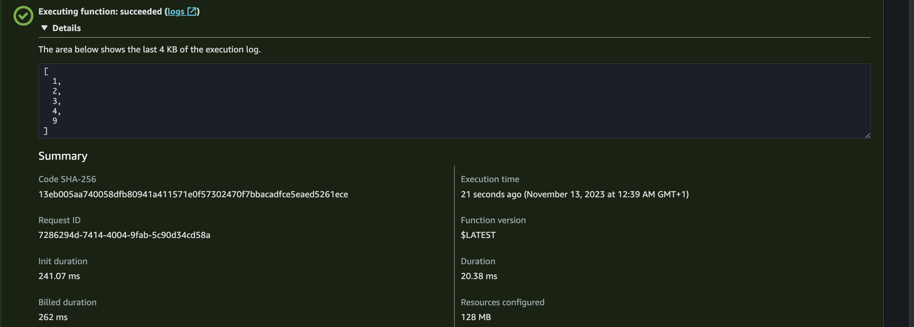

## TL;DR

AWS released a public base image for Node 20 Lambda runtime last week. It is now possible to deploy Node 20 Lambda functions on AWS, by using this image with ECR (Elastic Container Registry). In this article, discover how to deploy your first Node 20 Lambda function on AWS, before the managed runtime is released! **Stay tuned till the end to see the performance results.**

I you want to stay in touch here is my [twitter account][twitter]. I often post or re-post interesting stuff about AWS and serverless, feel free to follow me!

 Follow me on twitter 🚀 

_**Quick announcement:** I also work on a library called [🛡 sls-mentor 🛡][sls-mentor]. It is a compilation of 30 serverless best-practices, that are automatically checked on your AWS serverless projects (no matter the framework). It is free and open source, feel free to check it out!_

 Find sls-mentor on Github ⭐️ 

## 🚨 Last minute update: Node 20 managed runtime is now available, no need to use container images anymore 🚨

If you still want to learn how to deploy a Lambda function using a container image, back to the article ⬇️

## How to deploy a pre-release Node 20 Lambda function on AWS?

Node 20 isn't officially supported by AWS Lambda yet. However, AWS released a public base image for Node 20 Lambda runtime last week. It is possible to use this base image to build a custom runtime with docker, and use it to deploy Lambda functions on AWS. This is achieved in three simple steps:

- Build a Node 20 Lambda docker image based on the public AWS base image (done locally)
- Push this image to ECR (Elastic Container Registry)
- Create a Lambda function using this image

### Build a Node 20 Lambda docker image

First step: create a `dockerfile` to build a Node 20 Lambda docker image.

```dockerfile
FROM public.ecr.aws/lambda/nodejs:20.2023.11.12.08-arm64
COPY app.js ./
CMD [ "app.handler" ]
```

This image is derived from the official `public.ecr.aws/lambda/nodejs:20.2023.11.12.08-arm64` image. You can also use `public.ecr.aws/lambda/nodejs:20.2023.11.12.08-x86_64` if the target Lambda architecture is x86_64. Then, it copies the `app.js` file to the image, and sets the `CMD` to `app.handler`. This means that we have to create a `app.js` file in the same directory as the `dockerfile`, and define a `handler` function in it.

To test if the image runs on Node 20, let's use a Node 20 only feature: the Array.prototype.toSorted method, which creates a new sorted array without modifying the original array. This new method is only available in Node 20, so if the image runs on Node 20, it should work. Here is the `app.js` file:

```javascript
exports.handler = async () => {
  const table = [2, 3, 1, 9, 4];

  const sortedTable = table.toSorted(); // Only works on Node 20!

  return sortedTable; // [1, 2, 3, 4, 9]
};
```

We are done! Lets build the image! I add a `lambda-image:node-20` tag to the image, so that I can easily find it later.

```bash
docker build --platform linux/amd64 -t lambda-image:node-20 . # tag the image with your own tag
```

### Push the image to ECR (Elastic Container Registry)

Now that the image is built, we can push it to ECR. First, we need to create a repository in ECR. I will use the AWS CLI to do so. For all the following commands, replace `<REPOSITORY_NAME>` with the name you want to give to your repository, <AWS_ACCOUNT_ID> with your AWS account ID, and <AWS_REGION> with the AWS region you want to use.

```bash
# create the ECR repository
aws ecr create-repository --repository-name <REPOSITORY_NAME> --image-scanning-configuration scanOnPush=true --region <AWS_REGION>

# login docker to ECR
aws ecr get-login-password | docker login --username AWS --password-stdin <AWS_ACCOUNT_ID>.dkr.ecr.<AWS_REGION>.amazonaws.com

# tag the image with the ECR repository URI
docker tag lambda-image:node-20 <AWS_ACCOUNT_ID>.dkr.ecr.eu-west-1.amazonaws.com/<REPOSITORY_NAME>:latest

# push the image to ECR
docker push <AWS_ACCOUNT_ID>.dkr.ecr.eu-west-1.amazonaws.com/<REPOSITORY_NAME>:latest
```

We are done with Docker! Now, let's create a Lambda function using this image.

### Create a Lambda function using this image

For this step, I will use the Web UI, for clarity. You can also use any programmatic way to create your Lambda function. The process is pretty straightforward:


You are done! You can now test your Lambda function. If everything went well, you should see the following result:



The Array.prototype.toSorted method worked as expected! This means that the Lambda function ran on Node 20.

## Lambda Node 20 performance

In ran 50 cold and warm starts on this Lambda function, and measured the execution time. Here are the results, compared to a similar Lambda function running on the **aws-managed** Node 18 runtime:

| Runtime | Median execution time | Average execution time | Cold ⛄️ or warm 🔥 |
| ------- | --------------------- | ---------------------- | ------------------- |
| Node 18 | 177ms                 | 175ms                  | Cold ⛄️            |
| Node 20 | 236ms                 | 232ms                  | Cold ⛄️            |
| Node 18 | 2ms                   | 11ms                   | Warm 🔥             |
| Node 20 | 2.5ms                 | 28ms                   | Warm 🔥             |

What can we learn from these results? Node 20 is slower than Node 18 on cold starts, and has similar performance on warm starts. This is not surprising, as Node 20 is still in pre-release and is deployed using a container image, which has slower cold starts.

Expect the performance to be better when the managed Node 20 runtime is released!

## Let's connect!

I would really appreciate if you could react and share this article with your friends and colleagues. It will help me a lot to grow my audience. Also, don't forget to subscribe to be updated when the next article comes out!

I you want to stay in touch here is my [twitter account][twitter]. I often post or re-post interesting stuff about AWS and serverless, feel free to follow me!

 Follow me on twitter 🚀 

[twitter]: https://twitter.com/PierreChollet22
[sls-mentor]: https://www.sls-mentor.dev
