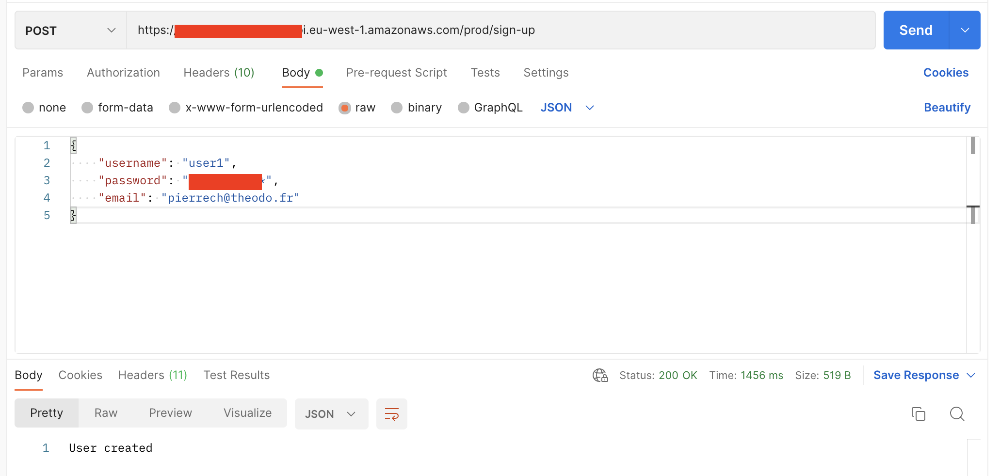
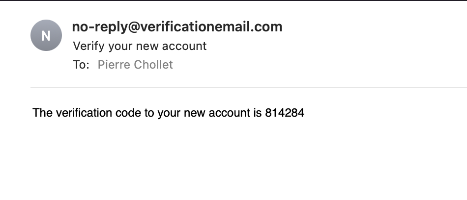
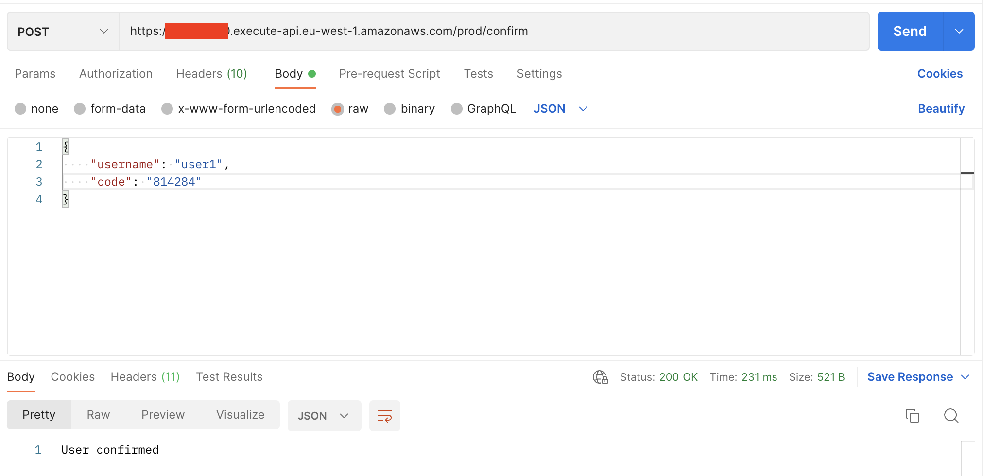
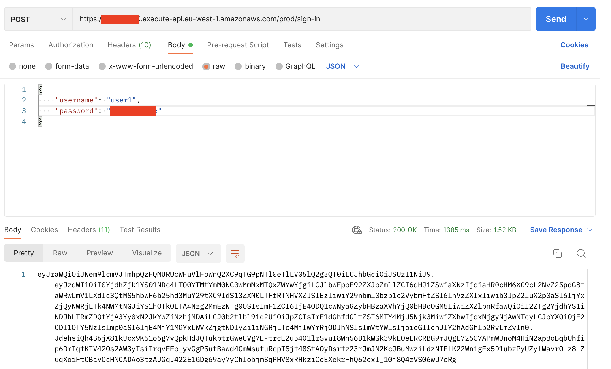
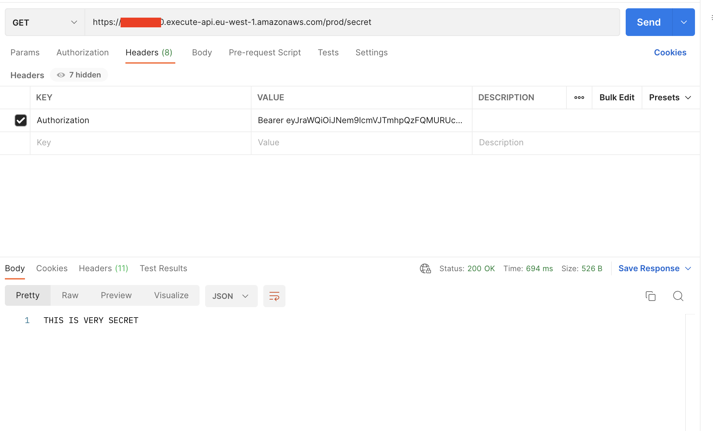

## TL;DR

In this series, I try to explain the basics of serverless on AWS, to enable you to build your own serverless applications. With last articles, we learned together how to create Lambda functions, rest APIs, databases and file storage. In this article, we will learn how to add authentication to our APIs using Cognito, handle sign-in, and create protected API routes.

## Introduction to Cognito

Cognito is the authentication service of AWS. It allows you to create user pools, which contain the information of your users (username, email, password, etc.), stored in a safe and secure way. Plugged on these user pools, you can create user pool clients, which are the applications that will use the user pools to authenticate users. For example, you can create a user pool for your web application, and another one for your mobile application. Each of these applications will have its own App Client, and will be able to authenticate users using the same user pool.

It can be easily described using this schema, where the user poll is the central element, and users can connect either via a frontend application or a lambda function.


## Today's goal - Create an API route protected by an authorizer

Today, we will create a simple API route that will be protected by an authorizer. This authorizer will be a Cognito user pool, and will allow us to authenticate users before they can access the API route. We will also create a sign up, confirm and a sign in route, that will allow users to authenticate themselves and get a JWT token that will be used to authenticate themselves on the protected route. In terms of architecture, it will look like this:


To build this infrastructure, I will use the AWS CDK combined with TypeScript. I already used this deployment method in the last articles of this series, feel free to check them out if you need a refresher 😉.

### Create a User Pool and a User Pool Client

Using AWS CDK, it is intuitive to create a user pool and an app client.

```typescript
import * as cdk from 'aws-cdk-lib';
import { Construct } from 'constructs';

export class MyFirstStack extends cdk.Stack {
  constructor(scope: Construct, id: string, props?: cdk.StackProps) {
    super(scope, id, props);

    const userPool = new cdk.aws_cognito.UserPool(this, 'myFirstUserPool', {
      selfSignUpEnabled: true,
      autoVerify: {
        email: true,
      },
    });

    const userPoolClient = new cdk.aws_cognito.UserPoolClient(this, 'myFirstUserPoolClient', {
      userPool,
      authFlows: {
        userPassword: true,
      },
    });
  }
}
```

Two steps: I create a User Pool with options allowing the users to self-sign-up and receive a confirmation email on their address. Then, I plug this user pool to a user pool client, which will be used to authenticate users. I enable the `userPassword` authentication flow, which will allow users to authenticate themselves using a username and a password.

### Signing up, confirming email address and signing in

In this tutorial, I will try to keep it simple. I will create three authentication API routes: the sign up route will allow users to create an account and receive a code by email, the confirm route will allow them to confirm their account, and the sign in route will allow users to authenticate themselves and get a JWT token.

Let's start by provisioning the 3 lambda functions corresponding to these 3 routes.

```typescript
// ... Previous code ...

// Provision a signup lambda function
const signup = new cdk.aws_lambda_nodejs.NodejsFunction(this, 'signup', {
  entry: path.join(__dirname, 'signup', 'handler.ts'),
  handler: 'handler',
  environment: {
    USER_POOL_CLIENT_ID: userPoolClient.userPoolClientId,
  },
});

// Give the lambda function the permission to sign up users
signup.addToRolePolicy(
  new cdk.aws_iam.PolicyStatement({
    actions: ['cognito-idp:SignUp'],
    resources: [userPool.userPoolArn],
  }),
);

// Provision a signup lambda function
const confirm = new cdk.aws_lambda_nodejs.NodejsFunction(this, 'confirm', {
  entry: path.join(__dirname, 'confirm', 'handler.ts'),
  handler: 'handler',
  environment: {
    USER_POOL_CLIENT_ID: userPoolClient.userPoolClientId,
  },
});

// Give the lambda function the permission to sign up users
confirm.addToRolePolicy(
  new cdk.aws_iam.PolicyStatement({
    actions: ['cognito-idp:ConfirmSignUp'],
    resources: [userPool.userPoolArn],
  }),
);

// Provision a signin lambda function
const signin = new cdk.aws_lambda_nodejs.NodejsFunction(this, 'signin', {
  entry: path.join(__dirname, 'signin', 'handler.ts'),
  handler: 'handler',
  environment: {
    USER_POOL_CLIENT_ID: userPoolClient.userPoolClientId,
  },
});

// GIve the lambda function the permission to sign in users
signin.addToRolePolicy(
  new cdk.aws_iam.PolicyStatement({
    actions: ['cognito-idp:InitiateAuth'],
    resources: [userPool.userPoolArn],
  }),
);
```

In this code snippet, I create three lambda functions, one for the sign up route, one for the confirm route and one for the sign in route. I also pass to them the user pool client id, which will be used to authenticate users.

Finally, I add the required IAM permissions to the lambda functions, to allow them to interact with the user pool. The first lambda function will need the `cognito-idp:SignUp` permission, the second one will need the `cognito-idp:ConfirmSignUp` and the third one will need the `cognito-idp:InitiateAuth` permission.

Next step, create the code inside of these Lambda functions. Let's start with the sign up function.

```typescript
import { CognitoIdentityProviderClient, SignUpCommand } from '@aws-sdk/client-cognito-identity-provider';

const client = new CognitoIdentityProviderClient({});

export const handler = async (event: { body: string }): Promise<{ statusCode: number; body: string }> => {
  const { username, password, email } = JSON.parse(event.body) as {
    username?: string;
    password?: string;
    email?: string;
  };

  if (username === undefined || password === undefined || email === undefined) {
    return Promise.resolve({ statusCode: 400, body: 'Missing username, email or password' });
  }

  const userPoolClientId = process.env.USER_POOL_CLIENT_ID;

  await client.send(
    new SignUpCommand({
      ClientId: userPoolClientId,
      Username: username,
      Password: password,
      UserAttributes: [
        {
          Name: 'email',
          Value: email,
        },
      ],
    }),
  );

  return { statusCode: 200, body: 'User created' };
};
```

In this code snippet, using the SDK, I send a SignUp command to the user pool. I get the clientId from the environment variable I specified in the provisioning part of the code before.

The confirm function is very similar.

```typescript
import { CognitoIdentityProviderClient, ConfirmSignUpCommand } from '@aws-sdk/client-cognito-identity-provider';

const client = new CognitoIdentityProviderClient({});

export const handler = async (event: { body: string }): Promise<{ statusCode: number; body: string }> => {
  const { username, code } = JSON.parse(event.body) as { username?: string; code?: string };

  if (username === undefined || code === undefined) {
    return Promise.resolve({ statusCode: 400, body: 'Missing username or confirmation code' });
  }

  const userPoolClientId = process.env.USER_POOL_CLIENT_ID;

  await client.send(
    new ConfirmSignUpCommand({
      ClientId: userPoolClientId,
      Username: username,
      ConfirmationCode: code,
    }),
  );

  return { statusCode: 200, body: 'User confirmed' };
};
```

The handler expects a confirmation code, which was received by email by the user wanting to sign up. Then, it triggers a ConfirmSignUp command to the user pool.

Finally, the sign in function.

```typescript
import { CognitoIdentityProviderClient, InitiateAuthCommand } from '@aws-sdk/client-cognito-identity-provider';

const client = new CognitoIdentityProviderClient({});

export const handler = async (event: { body: string }): Promise<{ statusCode: number; body: string }> => {
  const { username, password } = JSON.parse(event.body) as { username?: string; password?: string };

  if (username === undefined || password === undefined) {
    return Promise.resolve({ statusCode: 400, body: 'Missing username or password' });
  }

  const userPoolClientId = process.env.USER_POOL_CLIENT_ID;

  const result = await client.send(
    new InitiateAuthCommand({
      AuthFlow: 'USER_PASSWORD_AUTH',
      ClientId: userPoolClientId,
      AuthParameters: {
        USERNAME: username,
        PASSWORD: password,
      },
    }),
  );

  const idToken = result.AuthenticationResult?.IdToken;

  if (idToken === undefined) {
    return Promise.resolve({ statusCode: 401, body: 'Authentication failed' });
  }

  return { statusCode: 200, body: idToken };
};
```

This function expects a username and a password. Then, it triggers an InitiateAuth command to the user pool. This command will return an id token, which is a JWT token. This token can be used later by the user to authenticate.

### Create the API and the protected route

Now that the lambda functions are created, I can create the API and the protected route. I will use the API Gateway construct from the AWS CDK.

```typescript
// ... previous code ...

// Create a new API
const myFirstApi = new cdk.aws_apigateway.RestApi(this, 'myFirstApi', {});

// Add routes to the API
myFirstApi.root.addResource('sign-up').addMethod('POST', new cdk.aws_apigateway.LambdaIntegration(signup));
myFirstApi.root.addResource('sign-in').addMethod('POST', new cdk.aws_apigateway.LambdaIntegration(signin));
myFirstApi.root.addResource('confirm').addMethod('POST', new cdk.aws_apigateway.LambdaIntegration(confirm));
```

This code snippet creates a new API, and adds three routes to it. Each route is linked to a lambda function. The API Gateway construct will automatically create the required permissions to allow the API to trigger the lambda functions.

Now, let's create an authorizer based on the Cognito user pool, and assign it to a new route that we want to protect.

```typescript
// ... previous code ...

// Create an authorizer based on the user pool
const authorizer = new cdk.aws_apigateway.CognitoUserPoolsAuthorizer(this, 'myFirstAuthorizer', {
  cognitoUserPools: [userPool],
  identitySource: 'method.request.header.Authorization',
});

const secretLambda = new cdk.aws_lambda_nodejs.NodejsFunction(this, 'secret', {
  entry: path.join(__dirname, 'secret', 'handler.ts'),
  handler: 'handler',
});

// Create a new secret route, triggering the secret Lambda, and protected by the authorizer
myFirstApi.root.addResource('secret').addMethod('GET', new cdk.aws_apigateway.LambdaIntegration(secret), {
  authorizer,
  authorizationType: cdk.aws_apigateway.AuthorizationType.COGNITO,
});
```

Finally, the (simple) code for the secret lambda function.

```typescript
export const handler = async (): Promise<{ statusCode: number; body: string }> => {
  return Promise.resolve({ statusCode: 200, body: 'CAUTION !!! THIS IS VERY SECRET' });
};
```

### Deploying and testing the app

We are done! Last step, deploy the app and test it. To deploy the app, run the following command.

```sh
npm run cdk deploy
```

You can find the URL of the API in the AWS console, in the API Gateway section. I explained it in details in the first article of this series, feel free to check it out!

Time to test everything! First, let's sign up, I specify a username, email and password.



Once signed up, I receive an email with a confirmation code.



Then, I confirm the sign up by entering the code I received by email and my username.



Finally, I can sign in with my username and password.



The result of this request is a JWT token. I can use this token to access the secret route, by passing it in the Authorization header with this format: "Bearer <id_token>"



Everything works as expected!

## Conclusion

This tutorial is a very shallow introduction to serverless authentication on Cognito. It is a simple starter to be able to register and authenticate users. There are many more features that can be used, like multi-factor authentication, hosted UI authentication on your own domain, and more. Maybe I will cover these topics in a future article!

I plan to continue this series of articles on a bi-monthly basis. I already covered the creation of simple lambda functions and REST APIs, as well as interacting with DynamoDB databases and S3 buckets. You can follow this progress on my [repository][repository]! I will cover new topics like creating event-driven applications, type safety, and more. If you have any suggestions, do not hesitate to contact me!

I would really appreciate if you could react and share this article with your friends and colleagues. It will help me a lot to grow my audience. Also, don't forget to subscribe to be updated when the next article comes out!

I you want to stay in touch here is my [twitter account][twitter account]. I often post or re-post interesting stuff about AWS and serverless, feel free to follow me!

[repository]: https://github.com/PChol22/learn-serverless
[twitter account]: https://twitter.com/PierreChollet22
