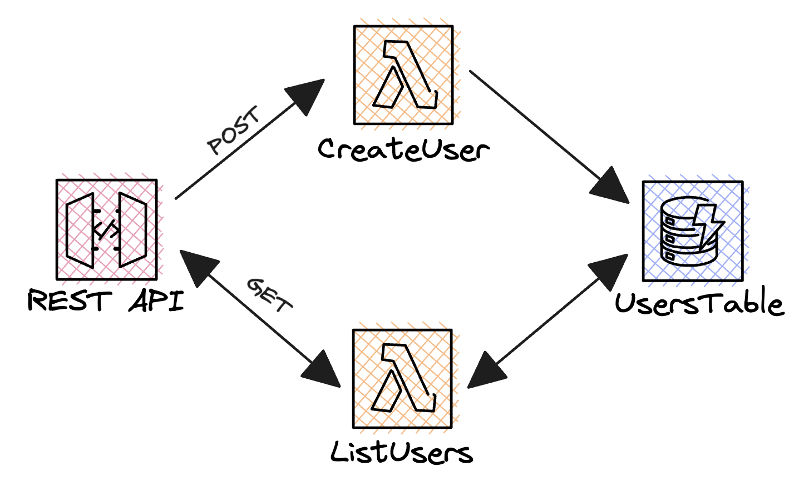
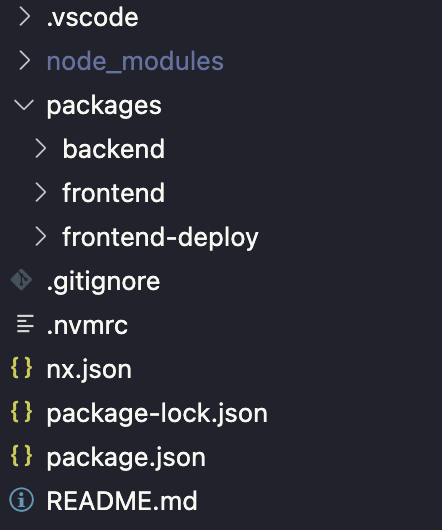

## TL;DR

In this [series][series], I try to explain the basics of serverless on AWS, to enable you to build your own serverless applications. During [last article][article-frontend], I showed you how to deploy a frontend on AWS, and how to make it interact with your serverless backend.

Maybe you noticed that we didn't share any types between our frontend and our backend: we weren't taking advantage of the fact that we were using the same language on both sides. In this article, we will see how to share types between our frontend and our backend, how to use them to make our code more robust, and how to use contracts to speed up our development!

_⚠️ This article is a direct follow-up of the [previous one][article-frontend]. If you haven't read it yet, I strongly recommend you to do so before reading this one! You can find the code where I left it [here][repository-last-article]._

**What will we do today?**

- Create contracts to share types between our frontend and our backend
- Use them to define lambda functions faster and more robustly
- Use them to make API calls from our frontend faster and more robustly

If you have difficulties to follow, you can find the code at the end of the article [here][repository].

## Where did we leave last time?

Last time, we created a simple backend consisting of two Lambda functions: createUser and listUsers. This lambda functions were interacting with an API and a DynamoDB table. We also created a frontend that was calling our backend to create and list users.

The architecture looked like this:



The repository looked like this:



On the code side, the handlers of our lambda functions were poorly typed: every thing was hardcoded, there was no relationship between the backend and the frontend: the code was hard to maintain (multiple sources of truth).

## Using contracts to share types between our frontend and our backend

What are contracts? Contracts are a piece of code that defines an interface between two parts of your application. In our case, we will use contracts to define the interface between our frontend and our backend. Our two routes will be defined by a contract, containing information such as :

- The path of the route
- The HTTP method of the route
- The input of the route
- The output of the route

This information will be available to both our frontend and our backend, so that we can use it to make our code more robust and faster to write.

### Creating serverless contracts

We want our contracts to be available to many packages, so taking advantage of NX, all we have to do is to create a new package called `contracts`, that will be shared between our frontend and our backend.

```bash
cd packages
mkdir contracts && cd contracts
npm init -y # We create a new package, and we initialize it
cp ../backend/tsconfig.json ./tsconfig.json # We re-use the TS config of our backend
```

**But how to create a contract?** The best library I know is called [@swarmion/serverless-contracts][swarmion-contracts], created by team [Swarmion][swarmion]. It exports super useful utils that will make the contracts we create very powerful in the scope of an AWS serverless application. Follow the article and you will understand why!

Let's install the library in our contracts package:

```bash
npm install @swarmion/serverless-contracts -S
```

Now, let's create a `index.ts` file in our contracts package, and let's create our first contract:

```typescript
import { ApiGatewayContract } from '@swarmion/serverless-contracts';

export const listUsersContract = new ApiGatewayContract({
  id: 'listUsers',
  path: '/users',
  method: 'GET',
  integrationType: 'restApi',
  outputSchemas: {
    [200]: {
      type: 'object',
      properties: {
        users: {
          type: 'array',
          items: {
            type: 'object',
            properties: {
              firstName: { type: 'string' },
              lastName: { type: 'string' },
              email: { type: 'string' },
            },
            required: ['firstName', 'lastName', 'email'],
            additionalProperties: false,
          },
        },
      },
      required: ['users'],
      additionalProperties: false,
    } as const, // This as const is important, it will make sure that the type of the object is inferred correctly
  },
});
```

Let's break down this code:

- First 4 keys are used to define the route of our contract: the path, the method, the integration type (restApi or httpApi).
- The `outputSchemas` key is used to define the output of our route. In our case, we define that the output of our route will be a 200 response, containing an object with a `users` key, containing an array of users. Each user will be an object with a `firstName`, a `lastName` and an `email`.

_You can define as many outputs as you want, for many different HTTP codes. This can allow you to correctly handle errors in your frontend, for example._

The syntax used to define the output is called [JSON Schema][json-schema]. It is a standard way to define the structure of a JSON object. If you know [zod][zod], the spirit is similar. Based on Swarmion's roadmap, it will be possible to use zod schemas to defined contracts in the future, which will be super cool!

Let's add the contract for createUser in the same file:

```typescript
// Previous code

export const createUserContract = new ApiGatewayContract({
  id: 'createUser',
  path: '/users',
  method: 'POST',
  integrationType: 'restApi',
  bodySchema: {
    type: 'object',
    properties: {
      email: { type: 'string' },
      firstName: { type: 'string' },
      lastName: { type: 'string' },
    },
    additionalProperties: false,
    required: ['email', 'firstName', 'lastName'],
  } as const,
  outputSchemas: {
    [200]: {
      type: 'object',
      properties: {
        message: { type: 'string' },
      },
      additionalProperties: false,
      required: ['message'],
    } as const,
  },
});
```

Like in the previous contract, we define information relative to the api path, the outputs of the route, and we also define the input of the route, using the `bodySchema` key. Here the body of the request will be an object with an `email`, a `firstName` and a `lastName`, with no additional properties allowed.

**We are done with the creation of our contracts! 🎉** Now, time to refactor our backend and our frontend to use them, and to see how they can help us!

## Using serverless contracts to define lambda functions

Additionally to ways to define contracts, Swarmion also export its killer feature: the `getHandler` function. This function generates a **fully typed lambda handler**, based on the contract you pass to it. Let's see how it works!

First, let's install the library in our backend package:

```bash
npm install @swarmion/serverless-contracts -S
npm install @middy/core @middy/http-cors -S # Will be useful for CORS managementt
```

Then, let's refactor our lambda functions to use the contracts we created:

```typescript
import { DynamoDBClient, QueryCommand } from '@aws-sdk/client-dynamodb';
import { listUsersContract } from '../../../contracts';
import { getHandler } from '@swarmion/serverless-contracts';
import middy from '@middy/core';
import cors from '@middy/http-cors';

const client = new DynamoDBClient({});

const main = getHandler(listUsersContract, {
  validateInput: false,
  validateOutput: false,
  returnValidationErrors: false,
})(async () => {
  const tableName = process.env.TABLE_NAME;

  if (!tableName) {
    throw new Error('Missing TABLE_NAME');
  }

  const { Items } = await client.send(
    new QueryCommand({
      TableName: tableName,
      KeyConditions: {
        PK: {
          ComparisonOperator: 'EQ',
          AttributeValueList: [{ S: 'USER' }],
        },
      },
    }),
  );

  const users = (Items ?? []).map(item => ({
    email: item.SK.S ?? '',
    firstName: item.firstName.S ?? '',
    lastName: item.lastName.S ?? '',
  }));

  return {
    statusCode: 200,
    body: {
      users,
    },
  };
});

export const handler = middy(main).use(cors());
```

If you compare this snippet with the code before refactoring, you will see that barely nothing changed. The only difference is that we are using the `getHandler` function to generate our handler. This makes it so that our handler now fully validates the input and the output of our lambda function, based on the contract we passed to it. Furthermore, there is no more need to do some JSON.parse and JSON.stringify, as the handler does it for us now!

I also decided to use the [middy][middy] library to add CORS management to our lambda function. This will allow us to call our lambda function from our frontend, without having to worry about CORS.

Notice that I disabled the validation of the input and the output of our lambda function. For now, the lambda doesn't validate at runtime that the input and the output of the lambda function are correct. If you want it to do so, you can remove the `validateInput` and `validateOutput` keys from the options and instead pass a `ajv` instance to the `ajv` key. This will make the lambda validate the input and the output of the lambda function at runtime, and throw an error if the input or the output is not correct (see swarmion docs for more info).

The handler of createUser is quite similar:

```typescript
import { DynamoDBClient, PutItemCommand } from '@aws-sdk/client-dynamodb';
import { getHandler } from '@swarmion/serverless-contracts';
import { createUserContract } from '../../../contracts';
import middy from '@middy/core';
import cors from '@middy/http-cors';

const client = new DynamoDBClient({});

const main = getHandler(createUserContract, {
  validateInput: false,
  validateOutput: false,
  returnValidationErrors: false,
})(async event => {
  const tableName = process.env.TABLE_NAME;

  if (!tableName) {
    throw new Error('Missing TABLE_NAME');
  }

  const { email, firstName, lastName } = event.body;

  await client.send(
    new PutItemCommand({
      TableName: tableName,
      Item: {
        PK: { S: 'USER' },
        SK: { S: email },
        firstName: { S: firstName },
        lastName: { S: lastName },
      },
    }),
  );

  return {
    statusCode: 200,
    body: {
      message: 'User created',
    },
  };
});

export const handler = middy(main).use(cors());
```

Here, the real power of Swarmion contracts comes from the fact that I can access the body of the request directly from the `event` object, without having to parse it. The body is also fully typed, based on the contract we passed to the `getHandler` function.

## Using serverless contracts in the Infrastructure as Code

Now that we have contracts, we can use them to define our infrastructure as code (the CDK code). This will ensure that lambda functions are configured on the correct path and with the correct HTTP method.

In my `backend-stack.ts` file, I can simplify some code to write:

```typescript
api.root.resourceForPath(createUserContract.path).addCorsPreflight({
  allowOrigins: cdk.aws_apigateway.Cors.ALL_ORIGINS,
  allowMethods: cdk.aws_apigateway.Cors.ALL_METHODS,
  allowHeaders: cdk.aws_apigateway.Cors.DEFAULT_HEADERS,
});
api.root
  .resourceForPath(listUsersContract.path)
  .addMethod(listUsersContract.method, new cdk.aws_apigateway.LambdaIntegration(listUsers));
api.root
  .resourceForPath(createUserContract.path)
  .addMethod(createUserContract.method, new cdk.aws_apigateway.LambdaIntegration(createUser));
```

## Using serverless contracts in the frontend

The second place where contracts will be extremely useful is in the frontend. Indeed, we can use them to generate the API calls we make to our backend.

First, let's install the library in our frontend package:

```bash
npm install @swarmion/serverless-contracts -S
```

Then, in our frontend, we can replace the old calls to `fetch` with calls generated from contracts:

```typescript
import { getFetchRequest } from '@swarmion/serverless-contracts';
import { createUserContract, listUsersContract } from '../../contracts';

// ... rest of the component

const syncUsers = async () => {
  const {
    body: { users },
  } = await getFetchRequest(listUsersContract, fetch, {
    baseUrl: import.meta.env.VITE_API_URL,
  });

  setUsers(users);
};
```

You can't see it on the article, but the users variable is correctly typed: it is an array of users, as defined in the contract. Plus we don't have to specify the path of the route or the HTTP method!

Same for the submit of the form:

```typescript
const onFormSubmit = async (e: React.FormEvent<HTMLFormElement>) => {
  e.preventDefault();
  await getFetchRequest(createUserContract, fetch, {
    baseUrl: import.meta.env.VITE_API_URL,
    body: {
      firstName,
      lastName,
      email,
    },
  });
  setUsers([...users, { firstName, lastName, email }]);
  await syncUsers();
};
```

We don't have to specify that it is a POST request, and the body of the request is correctly typed, based on the contract we passed to the `getFetchRequest` function.

## Conclusion

In this article, we saw how to use contracts to share types between our frontend and our backend, and how to use them to make our code more robust and faster to write:

- Type validation of the input and the output of our lambda functions
- No more need to parse the body of the request
- No more need to specify the path of the route or the HTTP method in the frontend
- Etc...

There are so many other things we can do with contracts, such as:

- Generating a Swagger documentation of our API
- Doing runtime validation of the input and the output of our lambda functions
- Using contracts from other services such as EventBridge

**⭐️ If you enjoyed this article, go give a huge star to the [Swarmion repository][swarmion-github] on Github, they truly deserve it! ⭐️**

You can find the code of this article [here][repository].

### Let's connect!

I would really appreciate if you could react and share this article with your friends and colleagues. It will help me a lot to grow my audience. Also, don't forget to subscribe to be updated when the next article comes out!

I you want to stay in touch here is my [twitter account][twitter]. I often post or re-post interesting stuff about AWS and serverless, feel free to follow me!

 Follow me on twitter 🚀 

[twitter]: https://twitter.com/PierreChollet22
[series]: https://dev.to/pchol22/series/22030
[article-frontend]: https://dev.to/slsbytheodo/learn-serverless-on-aws-step-by-step-deploy-a-frontend-31a6
[repository]: https://github.com/PChol22/learn-serverless-backendxfrontend
[repository-last-article]: https://github.com/PChol22/learn-serverless-backendxfrontend/tree/episode-12
[swarmion-contracts]: https://www.swarmion.dev/docs/how-to-guides/use-serverless-contracts/api-gateway
[swarmion]: https://www.swarmion.dev/
[json-schema]: https://json-schema.org/
[zod]: https://github.com/colinhacks/zod
[middy]: https://github.com/middyjs/middy
[swarmion-github]: https://github.com/swarmion/swarmion
