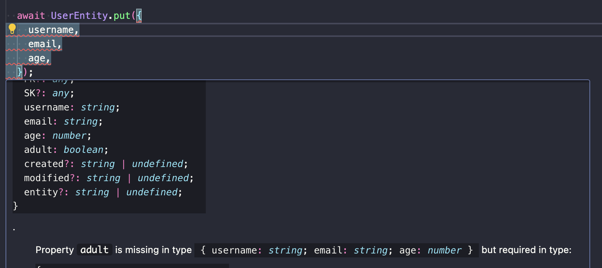
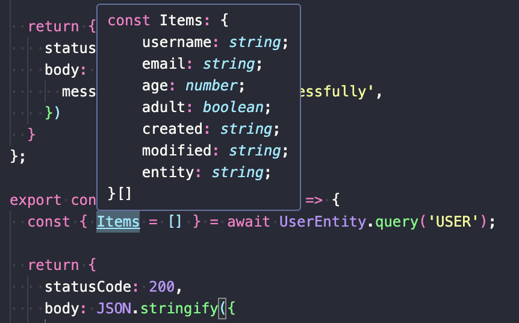

## TL;DR

In this [series][series], I try to explain the basics of serverless on AWS, to enable you to build your own serverless applications. During [last article][article-contracts], I showed you how to use contracts to use [🐝 swarmion 🐝][swarmion] to create Lambda functions easily and type them strongly. Today, let's continue with the same idea to improve our developer experience with DynamoDB!

I already wrote an article that is [an introduction to DynamoDB][dynamodb-article]. If you go and read it, you will quickly see that while being a great database, DynamoDB is painful to use in Lambda functions: items have a weird format, are not typed and building commands like queries does not feel natural. In this article, follow me through the process of improving our code step by step!

 Follow me on twitter 🚀 

### What will we do today?

- Create two very simple Lambda functions: createUser and listUsers, using the classic DynamoDB SDK
  - Users type will be : `{ username: string; email: string; age: number; adult: boolean }`
- Replace the DynamoDB SDK with the DocumentClient SDK, to get rid of the weird `.S .N .BOOL ...` format
- Replace the DocumentClient SDK with [dynamodb-toolbox][dynamodb-toolbox], to get a more natural API and strongly typed queries

If you have difficulties to follow, you can find the code at the end of the article [here][repository].

_**Quick announcement:** I also work on a library called [🛡 sls-mentor 🛡][sls-mentor]. It is a compilation of 30 serverless best-practices, that are automatically checked on your AWS serverless projects (no matter the framework). It is free and open source, feel free to check it out!_

 Find sls-mentor on Github ⭐️ 

## The classic (and painful) DynamoDB experience

### Setting up a DynamoDB table and Lambda functions

Like all the articles of this [series][series], we will use the AWS CDK with Typescript to create our infrastructure. If you are not familiar with it, go back to my [first article][article-lambda] to learn how to get started.

First, let's start by writing the Infrastructure as code in the CDK stack. We will create a DynamoDB table, an API and two Lambda functions, while not forgetting to give the right permissions and environment variables to the Lambda functions to access the DynamoDB table.

```typescript
import * as cdk from 'aws-cdk-lib';
import { Construct } from 'constructs';
import { join } from 'path';

// Use the Node18 runtime which provides the aws-sdk v3 natively
// This way our Lambda functions bundles will be smaller
const sharedLambdaConfig = {
  runtime: cdk.aws_lambda.Runtime.NODEJS_18_X,
  bundling: {
    externalModules: ['@aws-sdk'],
  },
};

export class BackendStack extends cdk.Stack {
  constructor(scope: Construct, id: string, props?: cdk.StackProps) {
    super(scope, id, props);

    const api = new cdk.aws_apigateway.RestApi(this, 'Api', {});

    const table = new cdk.aws_dynamodb.Table(this, 'DdbTable', {
      partitionKey: { name: 'PK', type: cdk.aws_dynamodb.AttributeType.STRING },
      sortKey: { name: 'SK', type: cdk.aws_dynamodb.AttributeType.STRING },
      billingMode: cdk.aws_dynamodb.BillingMode.PAY_PER_REQUEST,
    });

    const classicRoute = api.root.addResource('classic');

    const classicCreateUser = new cdk.aws_lambda_nodejs.NodejsFunction(this, 'ClassicCreateUser', {
      entry: join(__dirname, 'classic.ts'),
      handler: 'createUser',
      environment: {
        TABLE_NAME: table.tableName,
      },
      ...sharedLambdaConfig,
    });
    table.grantWriteData(classicCreateUser);
    classicRoute.addMethod('POST', new cdk.aws_apigateway.LambdaIntegration(classicCreateUser));

    const classicListUsers = new cdk.aws_lambda_nodejs.NodejsFunction(this, 'ClassicListUsers', {
      entry: join(__dirname, 'classic.ts'),
      handler: 'listUsers',
      environment: {
        TABLE_NAME: table.tableName,
      },
      ...sharedLambdaConfig,
    });
    table.grantReadData(classicListUsers);
    classicRoute.addMethod('GET', new cdk.aws_apigateway.LambdaIntegration(classicListUsers));
  }
}
```

_The `NodeJsFunction` construct requires esbuild to be installed in your project -> `npm i -D esbuild`_

Compared with my previous articles, nothing really new here! The only new improvement is the clever use of the Node18 runtime, which provides the aws-sdk v3 natively. This way, we don't need to bundle the aws-sdk in our Lambda functions, which makes them smaller. We do this by specifying the `externalModules` option in the `bundling` property of the `NodeJsFunction` construct.

### The classic DynamoDB Lambda function code

Based on the IAC we just created, we have to create a file named `classic.ts` in the same directory as the stack, and write the code of the lambda handlers inside. Using the classic DynamoDB SDK, it looks like this:

```typescript
import { DynamoDBClient, PutItemCommand, QueryCommand } from '@aws-sdk/client-dynamodb';

const ddbClient = new DynamoDBClient({});
const tableName = process.env.TABLE_NAME ?? '';

export const createUser = async (event: { body: string }) => {
  const { username, email, age, adult } = JSON.parse(event.body) as {
    username: string;
    email: string;
    age: number;
    adult: boolean;
  };

  await ddbClient.send(
    new PutItemCommand({
      TableName: tableName,
      Item: {
        PK: { S: 'USER' },
        SK: { S: username },
        email: { S: email },
        age: { N: age.toString() },
        adult: { BOOL: adult },
      },
    }),
  );

  return {
    statusCode: 200,
    body: JSON.stringify({
      message: 'User created successfully',
    }),
  };
};

export const listUsers = async () => {
  const { Items = [] } = await ddbClient.send(
    new QueryCommand({
      TableName: tableName,
      KeyConditionExpression: 'PK = :pk',
      ExpressionAttributeValues: {
        ':pk': { S: 'USER' },
      },
    }),
  );

  return {
    statusCode: 200,
    body: JSON.stringify({
      users: Items.map(user => ({
        username: user.SK.S,
        email: user.email.S,
        age: +(user.age.N ?? '0'),
        adult: user.adult.BOOL ?? false,
      })),
    }),
  };
};
```

If you read my [first dynamodb article][dynamodb-article], you will recognize the same structure. We create a `DynamoDBClient` and use it to send commands to DynamoDB.

- CreateUser: We have to be cautious to use the `.N .S .BOOL` format to interact with DynamoDB, to represent string, number and boolean attributes. This is not very natural and can be confusing.
- ListUser: We must use the KeyConditionExpression and ExpressionAttributeValues properties to setup our query. This is also quite painful!

Furthermore, we have to autocompletion and type safety when writing our code! This is OK in small projects, but can quickly become a nightmare in bigger projects.

But don't worry, I got you covered! First, let's replace the DynamoDB SDK with the DocumentClient SDK to get rid of the `.N .S .BOOL` format.

## Using DocumentClient instead of the classic DynamoDB SDK

The DocumentClient SDK is another SDK developed by AWS. Basically, it is a wrapper around the classic DynamoDB SDK, which automatically marshalls and unmarshalls (serializes and deserializes) the data for you. This way, you don't have to use the `.N .S .BOOL` format anymore, and you can use the native types of your programming language.

### Create two new Lambda functions

First, let's add two new Lambda functions to the IAC of the project in our CDK stack:

```typescript
// ... previous code
const documentRoute = api.root.addResource('document');

const documentCreateUser = new cdk.aws_lambda_nodejs.NodejsFunction(this, 'DocumentCreateUser', {
  entry: join(__dirname, 'document.ts'),
  handler: 'createUser',
  environment: {
    TABLE_NAME: table.tableName,
  },
  ...sharedLambdaConfig,
});
table.grantWriteData(documentCreateUser);
documentRoute.addMethod('POST', new cdk.aws_apigateway.LambdaIntegration(documentCreateUser));

const documentListUsers = new cdk.aws_lambda_nodejs.NodejsFunction(this, 'DocumentListUsers', {
  entry: join(__dirname, 'document.ts'),
  handler: 'listUsers',
  environment: {
    TABLE_NAME: table.tableName,
  },
  ...sharedLambdaConfig,
});
table.grantReadData(documentListUsers);
documentRoute.addMethod('GET', new cdk.aws_apigateway.LambdaIntegration(documentListUsers));
```

These two lambda functions have basically the same configuration as the previous ones, except that they use the `document.ts` file as entry point, and are linked to a new API route.

### Use the DocumentClient SDK inside Lambda functions

Let's create a new file named `document.ts` in the same directory as the stack, and write the code of the lambda handlers inside. Using the DocumentClient SDK, it looks like this:

```typescript
import { DynamoDBClient } from '@aws-sdk/client-dynamodb';
import { DynamoDBDocumentClient, PutCommand, QueryCommand } from '@aws-sdk/lib-dynamodb';

const ddbClient = new DynamoDBClient({});
const documentClient = DynamoDBDocumentClient.from(ddbClient);
const tableName = process.env.TABLE_NAME ?? '';

export const createUser = async (event: { body: string }) => {
  const { username, email, age, adult } = JSON.parse(event.body) as {
    username: string;
    email: string;
    age: number;
    adult: boolean;
  };

  await documentClient.send(
    new PutCommand({
      TableName: tableName,
      Item: {
        PK: 'USER',
        SK: username,
        email,
        age,
        adult,
      },
    }),
  );

  return {
    statusCode: 200,
    body: JSON.stringify({
      message: 'User created successfully',
    }),
  };
};

export const listUsers = async () => {
  const { Items = [] } = await documentClient.send(
    new QueryCommand({
      TableName: tableName,
      KeyConditionExpression: 'PK = :pk',
      ExpressionAttributeValues: {
        ':pk': 'USER',
      },
    }),
  );

  return {
    statusCode: 200,
    body: JSON.stringify({
      users: Items.map(user => ({
        username: user.SK,
        email: user.email,
        age: user.age,
        adult: user.adult,
      })),
    }),
  };
};
```

Let's break down the differences with the classic approach:

- First, we setup a `documentClient` that will send commands. It is built from the DynamoDBClient we already had (clearly showing how it is only a wrapper around the classic SDK).
- In the `createUser` Lambda handler, we can create a user using the `PutCommand`. This time, the code is easier to write and understand as the format is more natural.
- Same business in the `listUsers` Lambda handler. The `ExpressionAttributeValues` is cleaner and we don't have to use the `.S .N .BOOL` format when mapping the results.

With little effort, we already improved our developer experience! But there is still no type safety and autocompletion. All attributes are typed as `any`. It would also be cool if we could avoid writing technical attributes like `PK` and `SK` in our code. Let's see how we can do that using [dynamodb-toolbox][dynamodb-toolbox]!

## Using dynamodb-toolbox to abstract DynamoDB technicalities

What is [dynamodb-toolbox][dynamodb-toolbox]? In the documentation it is described as: _"A set of tools that makes it easy to work with Amazon DynamoDB and the DocumentClient"_. Furthermore, it says, **This is NOT an ORM!**: it is a set of tools that help write commands and queries in a more natural way, but it is not an heavy abstraction layer like an ORM.

### Create the last two Lambda functions

Like before, let's create the last two Lambda functions in our CDK stack:

```typescript
const toolboxRoute = api.root.addResource('toolbox');

const toolboxCreateUser = new cdk.aws_lambda_nodejs.NodejsFunction(this, 'ToolboxCreateUser', {
  entry: join(__dirname, 'toolbox.ts'),
  handler: 'createUser',
  environment: {
    TABLE_NAME: table.tableName,
  },
  ...sharedLambdaConfig,
});
table.grantWriteData(toolboxCreateUser);
toolboxRoute.addMethod('POST', new cdk.aws_apigateway.LambdaIntegration(toolboxCreateUser));

const toolboxListUsers = new cdk.aws_lambda_nodejs.NodejsFunction(this, 'ToolboxListUsers', {
  entry: join(__dirname, 'toolbox.ts'),
  handler: 'listUsers',
  environment: {
    TABLE_NAME: table.tableName,
  },
  ...sharedLambdaConfig,
});
table.grantReadData(toolboxListUsers);
toolboxRoute.addMethod('GET', new cdk.aws_apigateway.LambdaIntegration(toolboxListUsers));
```

### Use dynamodb-toolbox inside Lambda functions

[dynamodb-toolbox][dynamodb-toolbox] works by creating entities. Entities are a way to describe a format for your items. You can define multiple entities inside a single table (it's called single-table-design), but here we only need to create a `UserEntity`. Then, you can use Entities to perform actions like creating, updating, deleting and querying items with a defined format inside the table.

Let's create a userEntity.ts file containing the definition of our UserEntity:

```typescript
import { DynamoDBClient } from '@aws-sdk/client-dynamodb';
import { DynamoDBDocumentClient } from '@aws-sdk/lib-dynamodb';
import { Entity, Table } from 'dynamodb-toolbox';

const ddbClient = new DynamoDBClient({});
const documentClient = DynamoDBDocumentClient.from(ddbClient);

const table = new Table({
  // WARNING: Only import this file in Lambda functions that have this environment variable
  name: process.env.TABLE_NAME ?? '',
  partitionKey: 'PK',
  sortKey: 'SK',
  DocumentClient: documentClient,
});

export const UserEntity = new Entity({
  table,
  name: 'USER',
  attributes: {
    username: { type: 'string', required: true },
    email: { type: 'string', required: true },
    age: { type: 'number', required: true },
    adult: { type: 'boolean', required: true },
    PK: { partitionKey: true, default: 'USER', hidden: true },
    SK: { sortKey: true, default: ({ username }: { username: string }) => username, hidden: true },
  },
});
```

As you can see at the beginning of the code, dynamodb-toolbox is built over the DocumentClient we previously covered. Here, the interesting part of the code is the definition of the `attributes` of the entity.

- `username`, `email`, `age` and `adult` are classical attributes, that have string, number and boolean types. We also specify that they are required, so that Typescript checks for us that we don't forget to set them when we create a user.
- `PK` is the partition key of the table. We know that it is a constant value, so we set it by `default` (this way there is no risk of making a typo inside Lambda handlers). Furthermore, we make it `hidden` so that it is not returned when we query the table. (we already know that queried items are users because we use the `UserEntity`)
- `SK` is the sort key of the table. We can set it by default dynamically, using the username attribute specified above. This way, when using the `UserEntity` to create a user, we don't have to set the `SK` attribute. It hides technical details from us, and makes our code cleaner. We also hide it so that returned items only contain the attributes we care about.

Now, let's use the `UserEntity` inside our Lambda handlers, by creating a new file named `toolbox.ts` in the same directory as the stack:

```typescript
import { UserEntity } from './userEntity';

export const createUser = async (event: { body: string }) => {
  const { username, email, age, adult } = JSON.parse(event.body) as {
    username: string;
    email: string;
    age: number;
    adult: boolean;
  };

  await UserEntity.put({
    username,
    email,
    age,
    adult,
  });

  return {
    statusCode: 200,
    body: JSON.stringify({
      message: 'User created successfully',
    }),
  };
};

export const listUsers = async () => {
  const { Items = [] } = await UserEntity.query('USER');

  return {
    statusCode: 200,
    body: JSON.stringify({
      users: Items.map(user => ({
        username: user.username,
        email: user.email,
        age: user.age,
        adult: user.adult,
      })),
    }),
  };
};
```

The code has never been so clean! No more mentions to `PK` and `SK`, no more `.S .N .BOOL` format, no more `ExpressionAttributeValues` and `KeyConditionExpression`. The code is also strongly typed! If you forget to set an attribute when putting an item, Typescript will tell you. The result of the query is also typed, and you can use autocompletion to access the attributes of the returned items.

 ⬆️ _If we forget to set `adult`, Typescript will tell us!_

 ⬆️ _The result of the query is typed_

Finally, as you can see in the last screenshot, dynamodb-toolbox automatically generates attributes `created` and `modified`, that are the date of creation and last modification of the item. This is very useful to keep track of the history of your items!

## Conclusion

There is no demo in this article as it would be quite trivial, but if you deploy the code, you can test the three API endpoints and see that they work the same way. The only difference is the code of the Lambda handlers, which is cleaner and more natural when using DocumentClient, and even better, dynamodb-toolbox.

dynamodb-toolbox has much more to offer, like the possibility to use indexes, perform updates, scans, get etc... I encourage you to read the [documentation][dynamodb-toolbox] to learn more about it!

You can find the code of this article [here][repository].

### Let's connect!

I would really appreciate if you could react and share this article with your friends and colleagues. It will help me a lot to grow my audience. Also, don't forget to subscribe to be updated when the next article comes out!

I you want to stay in touch here is my [twitter account][twitter]. I often post or re-post interesting stuff about AWS and serverless, feel free to follow me!

 Follow me on twitter 🚀 

[twitter]: https://twitter.com/PierreChollet22
[series]: https://dev.to/pchol22/series/22030
[article-contracts]: https://dev.to/slsbytheodo/learn-serverless-on-aws-step-by-step-strong-types-213i
[repository]: https://github.com/PChol22/learn-serverless-ddb-toolbox
[dynamodb-article]: https://dev.to/slsbytheodo/learn-serverless-on-aws-step-by-step-databases-kkg
[swarmion]: https://github.com/swarmion/swarmion
[dynamodb-toolbox]: https://www.dynamodbtoolbox.com/
[article-lambda]: https://dev.to/slsbytheodo/dont-miss-on-the-cloud-revolution-learn-serverless-on-aws-the-right-way-1kac
[sls-mentor]: https://www.sls-mentor.dev
