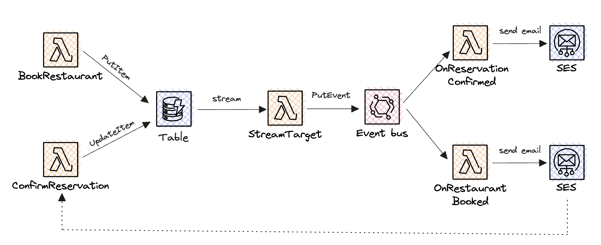
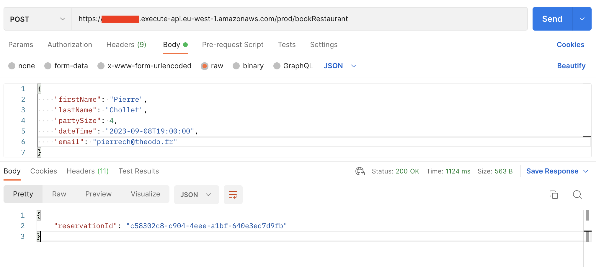
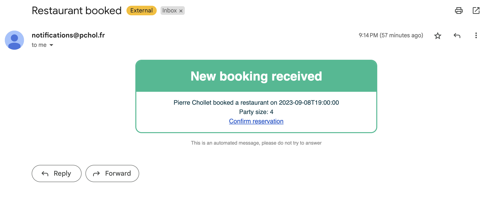
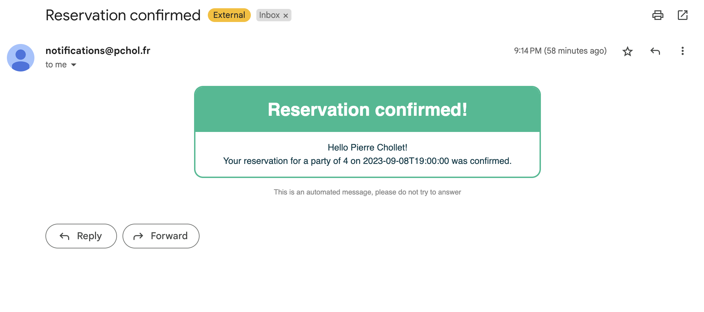

## TL;DR

In this series, I try to explain the basics of serverless on AWS, to enable you to build your own serverless applications. With [last article][article-sns], we discovered SNS topics and how to use them to send notifications. In this article, we will tackle DynamoDB streams, which allow to react to changes in a DynamoDB table!

**What will we do today?**

- I will show you how to react to items being inserted or modified inside a DynamoDB table.
- We will create a simple restaurant booking application powered by DynamoDB streams.
- Everything will be event-driven!

There is a lot of code in this article, because I wanted to provide an example close to a real-world application. If you only want to see the DynamoDB stream part, check the `Create a DynamoDB stream linked to a Lambda function` and `Third Lambda function: streamTarget` parts.

⬇️ I post serverless content very regularly, if you want more ⬇️

 Follow me on twitter 🚀 

_**Quick announcement:** I also work on a library called [🛡 sls-mentor 🛡][sls-mentor]. It is a compilation of 30 serverless best-practices, that are automatically checked on your AWS serverless projects (no matter the framework). It is free and open source, feel free to check it out!_

 Find sls-mentor on Github ⭐️ 

## What are DynamoDB streams and why are they useful?

Basically, DynamoDB streams allow a target to listen to changes being made inside a DynamoDB table. When doing serverless, this target is often a Lambda function, that has side-effects based on the changes made to the table.

This feature is very powerful: it allows you to build event-driven applications, where the components are loosely coupled: side-effects are triggered by changes in the database, and not by direct calls to the functions, that allows you to build very scalable applications.

Going further, DynamoDB streams are the major building block of serverless event-sourcing patterns on AWS. They allow you to build applications that are very resilient to failures, and that can be easily scaled. I won't go into details here, but check this [article by Maxime Vivier][cqrs-aws] if you want to learn more about this topic.

## Let's build a restaurant booking application!

In this article, we will build a simple restaurant booking application. Bookings can either be pending confirmation or confirmed. When a booking is created, it is pending and an email is sent to the restaurant with a link to confirm the booking. When the restaurant confirms the booking, the booking is marked as confirmed, and the customer receives an email with the confirmation.

To meet these requirements, we will store bookings inside a DynamoDB table, and react to items being inserted (bookings are created) or modified (bookings are confirmed) to send emails to the right people. The architecture of our application will look like this:



The most important part is in the middle of the diagram: a DynamoDB stream forwarding changes inside the table to a Lambda function. Depending on the situation, the Lambda function will dispatch events to the right Lambda to send the right email to the right person.

We will also create a link inside the email sent to the restaurant to confirm the booking, this link will trigger the confirmation process.

To develop this application, I will use the AWS CDK. I already used it in [all the articles of this series][series]. Moreover, every concept expect DynamoDB streams was already tackled before. So if you need a refresher, feel free check older articles!

## Setup the resources of our application

Let's start by creating a new CDK stack containing all the resources we will need, except for the lambda functions.

```typescript
import { Construct } from 'constructs';
import * as cdk from 'aws-cdk-lib';
import path from 'path';

import { restaurantBookedTemplateHtml } from './onRestaurantBooked/template';
import { reservationConfirmedTemplateHtml } from './onReservationConfirmed/template';

export class ArticleDDBStream extends Construct {
  constructor(scope: Construct, id: string, api: cdk.aws_apigateway.RestApi, identity: cdk.aws_ses.EmailIdentity) {
    super(scope, id);

    // Api to create and confirm bookings
    const api = new cdk.aws_apigateway.RestApi(this, 'api', {});

    // Table to store reservations
    const table = new cdk.aws_dynamodb.Table(this, 'ReservationsTable', {
      partitionKey: { name: 'SK', type: cdk.aws_dynamodb.AttributeType.STRING },
      sortKey: { name: 'PK', type: cdk.aws_dynamodb.AttributeType.STRING },
      billingMode: cdk.aws_dynamodb.BillingMode.PAY_PER_REQUEST,
      // We need to enable streams on the table
      stream: cdk.aws_dynamodb.StreamViewType.NEW_IMAGE,
    });

    // Event bus to dispatch events
    const bus = new cdk.aws_events.EventBus(this, 'EventBus');

    // SES Identity to send emails
    // You can also use an email address identity
    // Check my SES article for more details
    const DOMAIN_NAME = '<YOUR_DOMAIN_NAME>';
    const hostedZone = cdk.aws_route53.HostedZone.fromLookup(this, 'hostedZone', {
      domainName: DOMAIN_NAME,
    });
    const identity = new cdk.aws_ses.EmailIdentity(this, 'sesIdentity', {
      identity: cdk.aws_ses.Identity.publicHostedZone(hostedZone),
    });

    // Email template when a restaurant is booked
    const restaurantBookedTemplate = new cdk.aws_ses.CfnTemplate(this, 'RestaurantBookedTemplate', {
      template: {
        templateName: 'restaurantBookedTemplate',
        subjectPart: 'Restaurant booked',
        htmlPart: restaurantBookedTemplateHtml,
      },
    });

    // Email template when a reservation is confirmed
    const reservationConfirmedTemplate = new cdk.aws_ses.CfnTemplate(this, 'ReservationConfirmedTemplate', {
      template: {
        templateName: 'reservationConfirmedTemplate',
        subjectPart: 'Reservation confirmed',
        htmlPart: reservationConfirmedTemplateHtml,
      },
    });
  }
}
```

Nothing really new here, we create an api, a DynamoDB table, an event bus, an SES identity, and two SES templates. The only new thing is the `stream` property of the table. It allows us to create a DynamoDB stream linked to the table. The `NEW_IMAGE` value means that the stream will contain the new version of the item after it has been modified.

To stay short, I didn't include the content of the email templates. You can find them [here][template-pending] and [here][template-confirmed]. If you need a refresher on SES and templated emails, check [this article][article-ses].

## Create a DynamoDB stream linked to a Lambda function

Now that we are set up, let's create a Lambda function that will be triggered by the DynamoDB stream.

```typescript
// ... previous code
const streamTarget = new cdk.aws_lambda_nodejs.NodejsFunction(this, 'StreamTarget', {
  entry: path.join(__dirname, 'streamTarget', 'handler.ts'),
  handler: 'handler',
  environment: {
    EVENT_BUS_NAME: bus.eventBusName,
  },
});

table.grantStreamRead(streamTarget);
streamTarget.addEventSourceMapping('StreamSource', {
  eventSourceArn: table.tableStreamArn,
  startingPosition: cdk.aws_lambda.StartingPosition.LATEST,
  batchSize: 1,
});
streamTarget.addToRolePolicy(
  new cdk.aws_iam.PolicyStatement({
    actions: ['events:PutEvents'],
    resources: [bus.eventBusArn],
  }),
);
```

Linking a Lambda function to a DynamoDB stream consists of creating an event source mapping. This mapping will trigger the Lambda function every time an item is inserted or modified inside the table.

The `batchSize` property allows you to specify how many items will be sent to the Lambda function at once. Here, we set it to 1, so the Lambda function will be triggered for each item.

Do not forget to grant the Lambda function the right to read the stream (input), and to add the right to put events on the event bus (output).

## Create the rest of the Lambda functions

Finally, let's create the other 4 lambda functions:

- 2 to enable API calls to modify the table
- 2 to react to events dispatched by the stream target and send emails

```typescript
const bookRestaurant = new cdk.aws_lambda_nodejs.NodejsFunction(this, 'BookRestaurant', {
  entry: path.join(__dirname, 'bookRestaurant', 'handler.ts'),
  handler: 'handler',
  environment: {
    TABLE_NAME: table.tableName,
  },
});

table.grantWriteData(bookRestaurant);
api.root.addResource('bookRestaurant').addMethod('POST', new cdk.aws_apigateway.LambdaIntegration(bookRestaurant));

const confirmReservation = new cdk.aws_lambda_nodejs.NodejsFunction(this, 'ConfirmReservation', {
  entry: path.join(__dirname, 'confirmReservation', 'handler.ts'),
  handler: 'handler',
  environment: {
    TABLE_NAME: table.tableName,
  },
});

table.grantWriteData(confirmReservation);
api.root
  .addResource('confirmReservation')
  .addResource('{reservationId}')
  .addMethod('GET', new cdk.aws_apigateway.LambdaIntegration(confirmReservation));

const onRestaurantBookedRule = new cdk.aws_events.Rule(this, 'OnRestaurantBookedRule', {
  eventBus: bus,
  eventPattern: {
    source: ['StreamTarget'],
    detailType: ['OnRestaurantBooked'],
  },
});

const onRestaurantBooked = new cdk.aws_lambda_nodejs.NodejsFunction(this, 'OnRestaurantBookedLambda', {
  entry: path.join(__dirname, 'onRestaurantBooked', 'handler.ts'),
  handler: 'handler',
  environment: {
    FROM_EMAIL_ADDRESS: `notifications@${identity.emailIdentityName}`,
    API_URL: api.url,
    TEMPLATE_NAME: restaurantBookedTemplate.ref,
  },
});

onRestaurantBookedRule.addTarget(new cdk.aws_events_targets.LambdaFunction(onRestaurantBooked));
onRestaurantBooked.addToRolePolicy(
  new cdk.aws_iam.PolicyStatement({
    actions: ['ses:SendTemplatedEmail'],
    resources: ['*'],
  }),
);

const onReservationConfirmedRule = new cdk.aws_events.Rule(this, 'OnReservationConfirmedRule', {
  eventBus: bus,
  eventPattern: {
    source: ['StreamTarget'],
    detailType: ['OnReservationConfirmed'],
  },
});

const onReservationConfirmed = new cdk.aws_lambda_nodejs.NodejsFunction(this, 'OnReservationConfirmedLambda', {
  entry: path.join(__dirname, 'onReservationConfirmed', 'handler.ts'),
  handler: 'handler',
  environment: {
    FROM_EMAIL_ADDRESS: `notifications@${identity.emailIdentityName}`,
    TEMPLATE_NAME: reservationConfirmedTemplate.ref,
  },
});

onReservationConfirmedRule.addTarget(new cdk.aws_events_targets.LambdaFunction(onReservationConfirmed));
onReservationConfirmed.addToRolePolicy(
  new cdk.aws_iam.PolicyStatement({
    actions: ['ses:SendTemplatedEmail'],
    resources: ['*'],
  }),
);
```

The first two functions are very simple: they allow to create bookings and confirm them. They are linked to the API, so they can be called by anyone. They have the permission to edit the DynamoDB table. I used a GET endpoint to confirm a booking, in order to be able to use a link inside the email sent to the restaurant.

The last two functions are linked to the event bus. They will be triggered by the stream target, and will send emails to the right people. I used SES templated emails to send the emails, so I had to add the right to send templated emails to the Lambda functions.

## Implement the Lambda functions

Now that we have all the resources we need, let's implement the Lambda functions! To get started, let's settle on the format of the data we will store inside the table. It will simplify the code.

```typescript
// types.ts
export type Reservation = {
  // PK='RESERVATION'
  id: string; // SK
  firstName: string; // S
  lastName: string; // S
  email: string; // S
  dateTime: string; // S
  partySize: number; // N
  // status: S
};
```

### First Lambda function: `bookRestaurant`

```typescript
import { DynamoDBClient, PutItemCommand } from '@aws-sdk/client-dynamodb';

import { v4 as uuid } from 'uuid';
import { Reservation } from '../types';

const client = new DynamoDBClient({});

export const handler = async ({ body }: { body: string }): Promise<{ statusCode: number; body: string }> => {
  const tableName = process.env.TABLE_NAME;

  if (tableName === undefined) {
    throw new Error('TABLE_NAME environment variable must be defined');
  }

  const { firstName, lastName, email, dateTime, partySize } = JSON.parse(body) as Partial<Reservation>;

  if (
    firstName === undefined ||
    lastName === undefined ||
    email === undefined ||
    dateTime === undefined ||
    partySize === undefined
  ) {
    return {
      statusCode: 400,
      body: 'Bad request',
    };
  }

  const reservationId = uuid();

  await client.send(
    new PutItemCommand({
      TableName: tableName,
      Item: {
        PK: { S: `RESERVATION` },
        SK: { S: reservationId },
        firstName: { S: firstName },
        lastName: { S: lastName },
        email: { S: email },
        partySize: { N: partySize.toString() },
        dateTime: { S: dateTime },
        status: { S: 'PENDING' },
      },
    }),
  );

  return {
    statusCode: 200,
    body: JSON.stringify({
      reservationId,
    }),
  };
};
```

Easy: we parse the body of the request, and store the reservation inside the table. We set the status to `PENDING` by default. Check my [series of articles][series] if you need a refresher on how to interact with DynamoDB tables and API Gateway.

### Second Lambda function: `confirmReservation`

```typescript
import { DynamoDBClient, UpdateItemCommand } from '@aws-sdk/client-dynamodb';

const client = new DynamoDBClient({});

export const handler = async ({
  pathParameters,
}: {
  pathParameters: { reservationId: string };
}): Promise<{ statusCode: number; body: string; headers: unknown }> => {
  const tableName = process.env.TABLE_NAME;

  if (tableName === undefined) {
    throw new Error('TABLE_NAME environment variable must be defined');
  }

  await client.send(
    new UpdateItemCommand({
      TableName: tableName,
      Key: {
        PK: { S: `RESERVATION` },
        SK: { S: pathParameters.reservationId },
      },
      UpdateExpression: 'SET #status = :status',
      ExpressionAttributeNames: {
        '#status': 'status',
      },
      ExpressionAttributeValues: {
        ':status': { S: 'CONFIRMED' },
      },
    }),
  );

  return {
    statusCode: 200,
    body: JSON.stringify({
      reservationId: pathParameters.reservationId,
    }),
    headers: {
      'Content-Type': 'application/json',
      'Access-Control-Allow-Origin': '*',
    },
  };
};
```

This function is also very simple: it updates the status of the reservation to `CONFIRMED`. There are two little tricks here:

- The `status` attribute is a reserved keyword in DynamoDB, so we need to use an expression attribute name to update it.
- We need to add the `Access-Control-Allow-Origin` header to the response to allow the browser to call the API. (We want the link inside the email to work)

### Third Lambda function: `streamTarget`

```typescript
import { EventBridgeClient, PutEventsCommand } from '@aws-sdk/client-eventbridge';
import { Reservation } from '../types';

type InputProps = {
  Records: {
    eventName: string;
    dynamodb: {
      NewImage: {
        PK: { S: string };
        SK: { S: string };
        email: { S: string };
        firstName: { S: string };
        lastName: { S: string };
        dateTime: { S: string };
        partySize: { N: string };
        status: { S: string };
      };
    };
  }[];
};

const client = new EventBridgeClient({});

export const handler = async ({ Records }: InputProps): Promise<void> => {
  const eventBusName = process.env.EVENT_BUS_NAME;

  if (eventBusName === undefined) {
    throw new Error('EVENT_BUS_NAME environment variable is not set');
  }

  await Promise.all(
    Records.map(async ({ dynamodb, eventName }) => {
      if (eventName !== 'INSERT' && eventName !== 'MODIFY') {
        return;
      }

      const { SK, email, firstName, lastName, dateTime, partySize } = dynamodb.NewImage;

      const eventDetail: Reservation = {
        id: SK.S,
        firstName: firstName.S,
        lastName: lastName.S,
        email: email.S,
        dateTime: dateTime.S,
        partySize: +partySize.N,
      };

      await client.send(
        new PutEventsCommand({
          Entries: [
            {
              EventBusName: eventBusName,
              Source: 'StreamTarget',
              DetailType: eventName === 'INSERT' ? 'OnRestaurantBooked' : 'OnReservationConfirmed',
              Detail: JSON.stringify(eventDetail),
            },
          ],
        }),
      );
    }),
  );
};
```

This is the important part of the article: the Lambda function that will be triggered by the DynamoDB stream. The function receives a list of records, each record containing the new version of an item inside the table. We filter the records to only keep the ones that are `INSERT` or `MODIFY` events, and we dispatch events on the event bus based on the event type.

We also map back the DynamoDB item to a `Reservation` object, to simplify the code of the other Lambda functions.

### Fourth Lambda function: `onRestaurantBooked`

```typescript
import { SESv2Client, SendEmailCommand } from '@aws-sdk/client-sesv2';
import { Reservation } from '../types';

const client = new SESv2Client({});
const RESTAURANT_OWNER_EMAIL_ADDRESS = 'pierrech@theodo.fr';

export const handler = async ({ detail }: { detail: Reservation }): Promise<void> => {
  const templateName = process.env.TEMPLATE_NAME;
  const apiURL = process.env.API_URL;
  const fromEmailAddress = process.env.FROM_EMAIL_ADDRESS;

  if (templateName === undefined || apiURL === undefined || fromEmailAddress === undefined) {
    throw new Error('TEMPLATE_NAME, API_URL and FROM_EMAIL_ADDRESS environment variables must be defined');
  }

  await client.send(
    new SendEmailCommand({
      FromEmailAddress: fromEmailAddress,
      Destination: {
        ToAddresses: [RESTAURANT_OWNER_EMAIL_ADDRESS],
      },
      Content: {
        Template: {
          TemplateName: templateName,
          TemplateData: JSON.stringify({
            firstName: detail.firstName,
            lastName: detail.lastName,
            dateTime: detail.dateTime,
            partySize: detail.partySize,
            apiURL,
            reservationId: detail.id,
          }),
        },
      },
    }),
  );
};
```

This lambda reacts to an EventBridge event. It has access to the detail of the event, which is a `Reservation` object. It uses this data to hydrate the SES template and send an email to the restaurant owner. It also uses an API_URL environment variable to create the link to confirm the reservation. (The creation of the link is done inside the template, check it [here][template-pending])

Notice the email is sent to a fixed email address. In a real application, you would probably want to store the email address of the restaurant elsewhere, and retrieve it here.

### Fifth Lambda function: `onReservationConfirmed`

```typescript
import { SESv2Client, SendEmailCommand } from '@aws-sdk/client-sesv2';
import { Reservation } from '../types';

const client = new SESv2Client({});

export const handler = async ({ detail }: { detail: Reservation }): Promise<void> => {
  const templateName = process.env.TEMPLATE_NAME;
  const fromEmailAddress = process.env.FROM_EMAIL_ADDRESS;

  if (templateName === undefined || fromEmailAddress === undefined) {
    throw new Error('TEMPLATE_NAME and FROM_EMAIL_ADDRESS environment variables must be defined');
  }

  await client.send(
    new SendEmailCommand({
      FromEmailAddress: fromEmailAddress,
      Destination: {
        ToAddresses: [detail.email],
      },
      Content: {
        Template: {
          TemplateName: templateName,
          TemplateData: JSON.stringify({
            firstName: detail.firstName,
            lastName: detail.lastName,
            dateTime: detail.dateTime,
            partySize: detail.partySize,
          }),
        },
      },
    }),
  );
};
```

Basically the same thing here, except that the email template is simpler (no link). We send the email to the customer.

**And that's it!**

## Test the application

To test the application, we only need to execute a single API call from Postman. Let's create a booking:



Seconds later, I received an email (as a restaurant owner):



When I click on the link, the booking is confirmed. I received the confirmation email (as a customer):



It's as simple as that! The application is very scalable, because it is event-driven: we can add external API calls when the booking is confirmed, send receipts, process payments, etc... without modifying the underlying architecture of the application.

## Conclusion

This was a long article, but I hope you learned a lot! DynamoDB streams are a very powerful feature of AWS, next step in this direction would be to use them to create event-sourcing applications. One more time, I recommend you to check [this article][cqrs-aws] if you want to learn more about this topic.

I plan to continue this series of articles on a bi-monthly basis. I already covered the creation of simple lambda functions and REST APIs, as well as interacting with DynamoDB databases and S3 buckets. You can follow this progress on my [repository][repository]! I will cover new topics like front-end deployment, type safety, more advanced patterns, and more... If you have any suggestions, do not hesitate to contact me!

I would really appreciate if you could react and share this article with your friends and colleagues. It will help me a lot to grow my audience. Also, don't forget to subscribe to be updated when the next article comes out!

I you want to stay in touch here is my [twitter account][twitter]. I often post or re-post interesting stuff about AWS and serverless, feel free to follow me!

 Follow me on twitter 🚀 

[article-sns]: TODO
[twitter]: https://twitter.com/PierreChollet22
[repository]: https://github.com/PChol22/learn-serverless
[cqrs-aws]: https://dev.to/slsbytheodo/serverless-event-sourcing-with-aws-state-of-the-art-data-synchronization-4mog
[series]: https://dev.to/pchol22/series/22030
[template-confirmed]: https://github.com/PChol22/learn-serverless/blob/main/lib/articleDDBStream/onReservationConfirmed/template.ts
[template-pending]: https://github.com/PChol22/learn-serverless/blob/main/lib/articleDDBStream/onRestaurantBooked/template.ts
[article-ses]: https://dev.to/slsbytheodo/learn-serverless-on-aws-step-by-step-emails-49hp
[sls-mentor]: https://sls-mentor.dev
