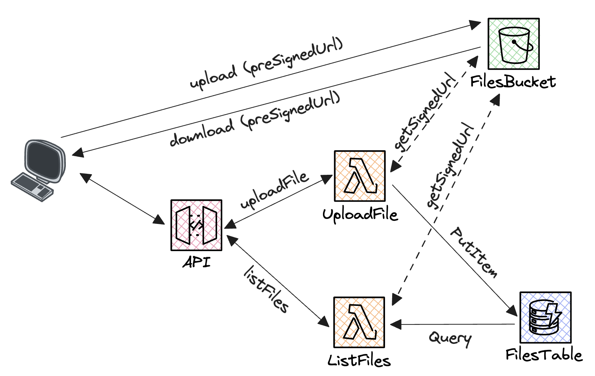

## TL;DR

In this [series][series], I try to explain the basics of serverless on AWS, to enable you to build your own serverless applications. During [last article][dynamodb-article], we tackled some more advanced DynamoDB concepts, like the use of a DocumentClient or dynamodb-toolbox to improve the developer experience. Today, we will learn how to upload files on S3 from a React application, using a Lambda function and a presigned URL.

I already wrote an article that is [an introduction to S3][s3-article]. In this old article, we tackled the basics of working with S3, by storing simple text files on AWS. Today, let's go further and code a real-world use case: uploading files and downloading files from a React application.

 Follow me on twitter 🚀 

### What will we do today?

- Create a simple backend allowing a user to upload a file on S3, and list all the files he uploaded
- Create a React application that will use this backend to upload and list files
- To do this, we will discover together the concept of presigned URLs, and how to use them to upload files on S3

If you have difficulties to follow, you can find the code at the end of the article [here][repository].

_**Quick announcement:** I also work on a library called [🛡 sls-mentor 🛡][sls-mentor]. It is a compilation of 30 serverless best-practices, that are automatically checked on your AWS serverless projects (no matter the framework). It is free and open source, feel free to check it out!_

 Find sls-mentor on Github ⭐️ 

## How to upload files on S3?

The new concept I want to introduce today is the concept of presigned URLs. A presigned URL is a URL that is generated by AWS, and that gives temporary access to a resource. For example, a Lambda function in your backend can generate a presigned URL that allows you to download or upload a file directly from your frontend to S3.

The basic idea is to request a presigned URL from your backend, and then use it in your frontend to upload or download a file. The presigned URL is generated by AWS, and contains all the information needed to access the resource. It is signed by your backend, so that AWS can verify that the request comes from your backend.

The application we are going to build will look like this:



It will contain two lambda functions:

- **UploadFile** will add the name of the file uploaded by the user in a DynamoDB table (to keep track of the files uploaded by each user), and will generate a presigned URL that will allow the user to upload the file on S3.
- **ListFiles** will list all the files uploaded by the user, by querying the DynamoDB table, and generate a presigned URL for each file, that will allow the user to download the file from S3.

## Create a AWS backend to upload and download files

First, let's start by creating the backend of our application. We will use the AWS CDK with Typescript to create our infrastructure. If you are not familiar with it, go back to my [first article][article-lambda] to learn how to get started.

### Provisioning the infrastructure

Based on the architecture diagram above, we have to create a DynamoDB table, an API, two Lambda functions and a S3 bucket. We also have to give the right permissions to the Lambda functions to access the DynamoDB table and the S3 bucket.

```typescript
import * as cdk from 'aws-cdk-lib';
import { Construct } from 'constructs';
import { join } from 'path';

export class UploadS3BackStack extends cdk.Stack {
  constructor(scope: Construct, id: string, props?: cdk.StackProps) {
    super(scope, id, props);

    // Create an API Gateway REST API
    const api = new cdk.aws_apigateway.RestApi(this, 'Api');

    // Create a DynamoDB table to store files
    const filesTable = new cdk.aws_dynamodb.Table(this, 'Files', {
      partitionKey: { name: 'PK', type: cdk.aws_dynamodb.AttributeType.STRING },
      sortKey: { name: 'SK', type: cdk.aws_dynamodb.AttributeType.STRING },
      billingMode: cdk.aws_dynamodb.BillingMode.PAY_PER_REQUEST,
    });

    // Create an S3 bucket with CORS enabled
    const bucket = new cdk.aws_s3.Bucket(this, 'Bucket', {
      cors: [
        {
          allowedMethods: [
            cdk.aws_s3.HttpMethods.GET,
            cdk.aws_s3.HttpMethods.PUT,
            cdk.aws_s3.HttpMethods.POST,
            cdk.aws_s3.HttpMethods.DELETE,
          ],
          allowedOrigins: ['*'],
          allowedHeaders: ['*'],
        },
      ],
    });

    // Create a Lambda function to upload a file
    const uploadFileLambda = new cdk.aws_lambda_nodejs.NodejsFunction(this, 'UploadFile', {
      entry: join(__dirname, 'uploadFile.ts'),
      handler: 'handler',
      environment: {
        TABLE_NAME: filesTable.tableName,
        BUCKET_NAME: bucket.bucketName,
      },
    });
    filesTable.grantReadWriteData(uploadFileLambda);
    bucket.grantPut(uploadFileLambda);
    bucket.grantPutAcl(uploadFileLambda);

    // Plug the Lambda function into API Gateway, and enable CORS
    const uploadFileResource = api.root.addResource('uploadFile');
    uploadFileResource.addMethod('POST', new cdk.aws_apigateway.LambdaIntegration(uploadFileLambda));
    uploadFileResource.addCorsPreflight({
      allowOrigins: ['*'],
      allowMethods: ['POST'],
    });

    // Create a Lambda function to list files
    const listFilesLambda = new cdk.aws_lambda_nodejs.NodejsFunction(this, 'ListFiles', {
      entry: join(__dirname, 'listFiles.ts'),
      handler: 'handler',
      environment: {
        TABLE_NAME: filesTable.tableName,
        BUCKET_NAME: bucket.bucketName,
      },
    });
    filesTable.grantReadData(listFilesLambda);
    bucket.grantRead(listFilesLambda);

    // Plug the Lambda function into API Gateway, and enable CORSs
    const listFilesResource = api.root.addResource('listFiles');
    listFilesResource.addMethod('POST', new cdk.aws_apigateway.LambdaIntegration(listFilesLambda));
    listFilesResource.addCorsPreflight({
      allowOrigins: ['*'],
      allowMethods: ['POST'],
    });
  }
}
```

In the code above:

- **We create an API and a DynamoDB table** (classic business)
- **We create a S3 Bucket**. We also have to enable CORS on the bucket, so that we can upload files from our frontend using presigned URLs. You can restrict the CORS configuration to your frontend domain if you want, but for the sake of simplicity, we will allow all origins.
- **We create two Lambda functions**. We will see the code of these functions later. For now, we just have to know that the first one will allow us to upload a file on S3, and the second one will allow us to list all the files uploaded by a user.
- **We plug the Lambda functions into API Gateway**. We also enable CORS on the API Gateway resources, so that we can call the API from our frontend.
- **We give the right permissions to the Lambda functions**. The first Lambda function needs to read and write in the DynamoDB table, and to write in the S3 bucket. The second Lambda function needs to read in the DynamoDB table and in the S3 bucket.

### Generate an upload presigned URL from a Lambda function

Now, let's write the code for the uploadFile Lambda function. Based on our IAC, we have to write the code inside the `uploadFile.ts` file.

```typescript
import { DynamoDBClient, PutItemCommand } from '@aws-sdk/client-dynamodb';
import { PutObjectCommand, S3Client } from '@aws-sdk/client-s3';
import { getSignedUrl } from '@aws-sdk/s3-request-presigner';

const dynamoDBClient = new DynamoDBClient({});
const s3Client = new S3Client({});

export const handler = async (event: {
  body: string;
}): Promise<{ statusCode: number; body: string; headers: unknown }> => {
  const tableName = process.env.TABLE_NAME;
  const bucketName = process.env.BUCKET_NAME;

  if (tableName === undefined || bucketName === undefined) {
    throw new Error('Missing environment variable');
  }

  const { userId, fileName } = JSON.parse(event.body) as { userId?: string; fileName?: string };

  if (userId === undefined || fileName === undefined) {
    return Promise.resolve({
      statusCode: 400,
      body: JSON.stringify({ message: 'Missing userId or fileName' }),
      headers: {
        'Access-Control-Allow-Origin': '*',
      },
    });
  }

  await dynamoDBClient.send(
    new PutItemCommand({
      TableName: tableName,
      Item: {
        PK: { S: userId },
        SK: { S: fileName },
      },
    }),
  );

  const uploadUrl = await getSignedUrl(
    s3Client,
    new PutObjectCommand({
      Bucket: bucketName,
      Key: `${userId}/${fileName}`,
    }),
    { expiresIn: 60 },
  );

  return {
    statusCode: 200,
    body: JSON.stringify({ uploadUrl }),
    headers: {
      'Access-Control-Allow-Origin': '*',
    },
  };
};
```

In the code above, we:

- **Read the environment variables**. We need the name of the DynamoDB table and the name of the S3 bucket to perform our operations.
- **Read the body of the request**. The body of the request contains the userId and the fileName of the file we want to upload. We will use this information to store the file in the DynamoDB table.
- **Put an item in the DynamoDB table**. We store the userId and the fileName in the DynamoDB table, so that we can list all the files uploaded by a user later.
- **Generate a presigned URL**. We generate a presigned URL that will allow the user to upload a file on S3. The presigned URL is valid for 60 seconds, and is signed by our backend, so that AWS can verify that the request comes from our backend. During the next 60 seconds, any person using this url will be able to upload a file on S3, without having to go through our backend. This is the magic of presigned URLs!
- **Return the presigned URL**. We return the presigned URL to the frontend, so that it can upload the file on S3. Don't forget to enable CORS on the API Gateway resource, so that the frontend can call the API.

### Generate download presigned URLs from a Lambda function

Now, let's write the code for the listFiles Lambda function. Based on our IAC, we have to write the code inside the `listFiles.ts` file.

```typescript
import { DynamoDBClient, QueryCommand } from '@aws-sdk/client-dynamodb';
import { GetObjectCommand, S3Client } from '@aws-sdk/client-s3';
import { getSignedUrl } from '@aws-sdk/s3-request-presigner';

const dynamoDBClient = new DynamoDBClient({});
const s3Client = new S3Client({});

export const handler = async ({
  body,
}: {
  body: string;
}): Promise<{ statusCode: number; body: string; headers: unknown }> => {
  const tableName = process.env.TABLE_NAME;
  const bucketName = process.env.BUCKET_NAME;

  if (tableName === undefined || bucketName === undefined) {
    throw new Error('Missing environment variable');
  }

  const { userId } = JSON.parse(body) as { userId?: string };

  if (userId === undefined) {
    return Promise.resolve({
      statusCode: 400,
      body: JSON.stringify({ message: 'Missing userId' }),
      headers: {
        'Access-Control-Allow-Origin': '*',
      },
    });
  }

  const { Items: files = [] } = await dynamoDBClient.send(
    new QueryCommand({
      TableName: tableName,
      KeyConditionExpression: 'PK = :pk',
      ExpressionAttributeValues: {
        ':pk': { S: userId },
      },
    }),
  );

  const filesWithPresignedUrls = await Promise.all(
    files.map(async ({ SK }) => {
      const fileName = SK?.S ?? '';

      const downloadUrl = await getSignedUrl(
        s3Client,
        new GetObjectCommand({
          Bucket: bucketName,
          Key: `${userId}/${fileName}`,
        }),
        { expiresIn: 60 },
      );

      return { fileName, downloadUrl };
    }),
  );

  return {
    statusCode: 200,
    body: JSON.stringify({ files: filesWithPresignedUrls }),
    headers: {
      'Access-Control-Allow-Origin': '*',
    },
  };
};
```

In the code above, we:

- **Read the environment variables**. Same as before.
- **Read the body of the request**. Same as before.
- **Query the DynamoDB table**. We query the DynamoDB table to get all the files uploaded by the user.
- **Generate a presigned URL for each file**. For each file, we generate a presigned URL that will allow the user to download the file from S3. These presigned URLs allow each file to be downloaded by the frontend, without having to go through our backend.
- **Return the presigned URLs**. We return the presigned URLs to the frontend, so that it can download the files from S3. Don't forget to enable CORS on the API Gateway resource, so that the frontend can call the API.

We are done with the backend! Final step: deploy the backend on AWS.

```bash
npm i @aws-sdk/client-dynamodb @aws-sdk/client-s3 @aws-sdk/s3-request-presigner # Install required dependencies
npm i -D esbuild # We need esbuild as a devDep to bundle our Lambda functions
npm run cdk bootstrap # Only the first time you use CDK on your AWS account
npm run cdk deploy
```

## Create a React application to upload and download files

Finally, let's create a React application that will use our backend to upload and download files. The quickest way to create a React application is to use [vite][vite], it allows you to create a simple SPA in seconds.

```bash
npm create vite
```

Let's create a very simple frontend, consisting of only one page containing :

- A `userId` input to "Login" the user (you can do much better than this, but it is not the point of this article)
- A `List files` button to list all the files uploaded by the user. This button will call the `listFiles` API endpoint.
- A `File` input to chose a file and a `Upload file` button to upload the file on S3. This button will sequentially call the `uploadFile` API endpoint, and then upload the file on S3 using the presigned URL returned by the API.
- An array of images, **each image having a source equal to the presigned URL of the file**

The code for this page looks like this:

```tsx
import { useState } from 'react';

function App() {
  const [files, setFiles] = useState<{ fileName: string; downloadUrl: string }[]>([]);
  const [userId, setUserId] = useState<string>('');
  const [file, setFile] = useState<File | null>(null);

  const listFiles = async (userId: string) => {
    const response = await fetch(`${import.meta.env.VITE_API_URL}/listFiles`, {
      method: 'POST',
      body: JSON.stringify({ userId }),
    });
    const { files } = (await response.json()) as { files: { fileName: string; downloadUrl: string }[] };
    setFiles(files);
  };

  return (
    <div>
      <div>
        <input type="text" value={userId} onChange={e => setUserId(e.target.value)} />
        <button onClick={() => listFiles(userId)} disabled={userId === ''}>
          List files
        </button>
      </div>
      {userId !== '' && (
        <div>
          <p>Upload File</p>
          <input
            type="file"
            onChange={e => {
              if (e.target.files) {
                setFile(e.target.files[0]);
              }
            }}
            max={1}
            accept="image/png, image/jpeg"
          />
          <button
            onClick={async () => {
              if (file === null) {
                throw new Error('File is null');
              }

              const fileName = file.name;
              const response = await fetch(`${import.meta.env.VITE_API_URL}/uploadFile`, {
                method: 'POST',
                body: JSON.stringify({ userId, fileName }),
              });
              const { uploadUrl } = (await response.json()) as { uploadUrl: string };

              await fetch(uploadUrl, {
                method: 'PUT',
                body: file,
                headers: {
                  'Content-Type': file.type,
                },
              });

              await listFiles(userId);
            }}
            disabled={file === null}
          >
            Upload
          </button>
        </div>
      )}
      <div>
        {files.map(({ downloadUrl, fileName }) => (
          
        ))}
      </div>
    </div>
  );
}

export default App;
```

Notice I use the `import.meta.env.VITE_API_URL` variable to call the API. You must define this variable in the `.env` file of the project, based on the URL of the API you just deployed.

```bash
# .env (root of the frontend project)
VITE_API_URL=https://.......
```

## Demo time!

When we start the app, we type a userId, and are able to list the files uploaded by this user. We can also upload a file, and see it appear in the list of files. For now, there is no file in the list, because we haven't uploaded any file yet.


I grant you that the UI is not very pretty 🤣 (this is not the point today). Now, we can use the file input to chose a file to upload.


When we click on the `Upload` button, the file is uploaded on S3, and we can see it appear in the list of files. The list of files is refreshed automatically after the upload!


## What's next?

There are a lot of things we could do to improve this application, for example:

- Implement a real authentication system
- Use this authentication to restrict who can upload and download files (user1 should not be able to download files uploaded by user2!!!)
- Restrict in the backend the file types that can be uploaded (extension, size, etc...)
- Implement a folder system, to recreate your own Google Drive!
- Improve the UI 🤣

You can find the code of this article [here][repository].

### Let's connect!

I would really appreciate if you could react and share this article with your friends and colleagues. It will help me a lot to grow my audience. Also, don't forget to subscribe to be updated when the next article comes out!

I you want to stay in touch here is my [twitter account][twitter]. I often post or re-post interesting stuff about AWS and serverless, feel free to follow me!

 Follow me on twitter 🚀 

[twitter]: https://twitter.com/PierreChollet22
[series]: https://dev.to/pchol22/series/22030
[s3-article]: https://dev.to/slsbytheodo/learn-serverless-on-aws-step-by-step-file-storage-10f7
[repository]: https://github.com/PChol22/learn-serverless-upload-s3
[dynamodb-article]: https://dev.to/slsbytheodo/learn-serverless-on-aws-step-by-step-databases-kkg
[article-lambda]: https://dev.to/slsbytheodo/dont-miss-on-the-cloud-revolution-learn-serverless-on-aws-the-right-way-1kac
[sls-mentor]: https://www.sls-mentor.dev
[vite]: https://vitejs.dev
