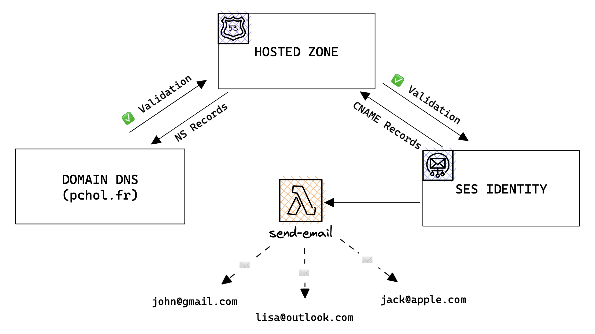
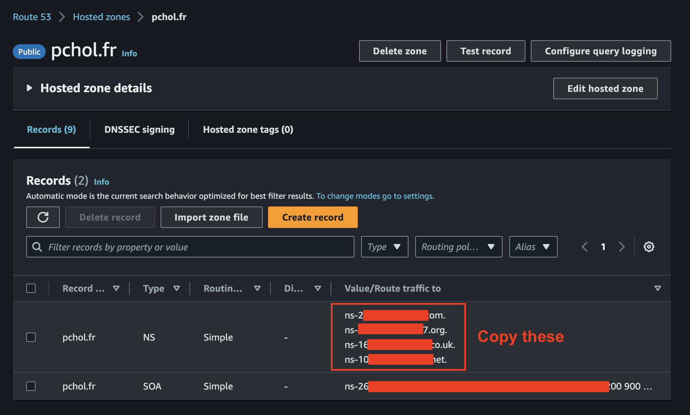
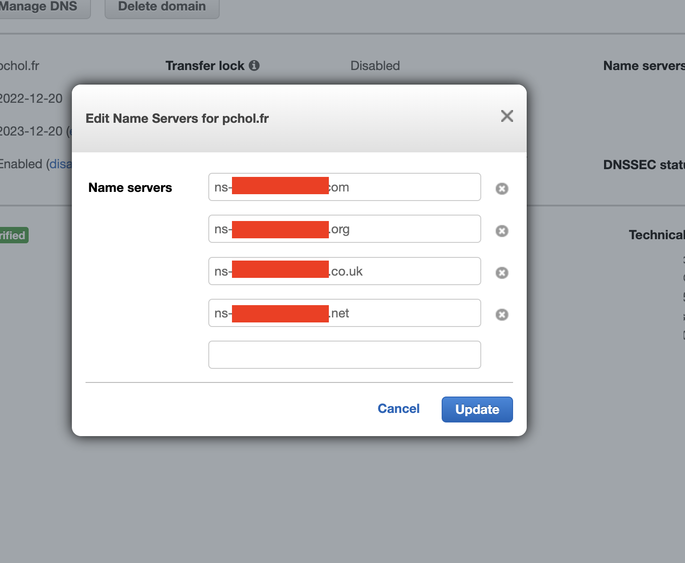
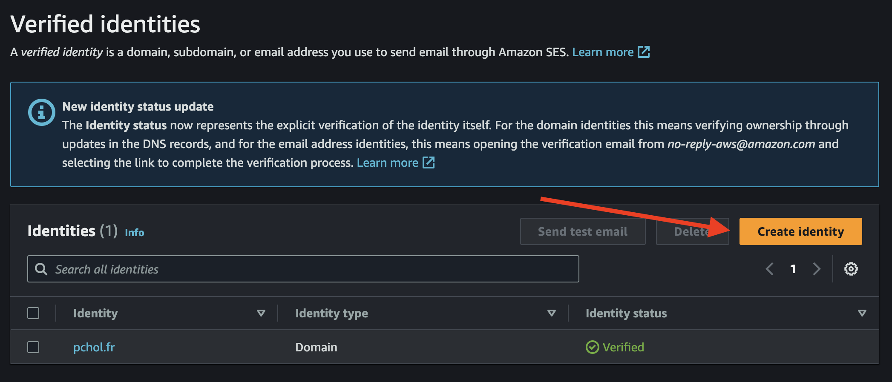
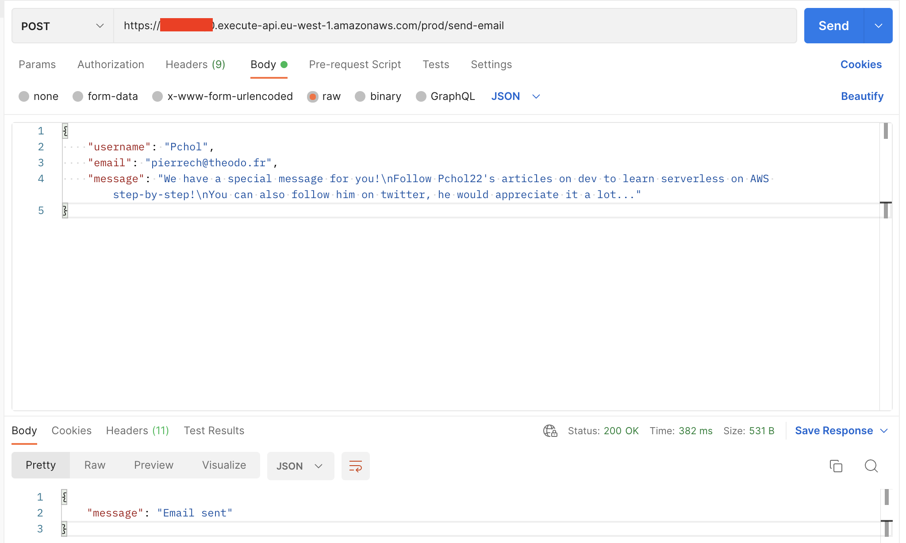
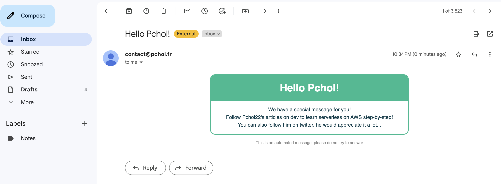

## TL;DR

In this series, I try to explain the basics of serverless on AWS, to enable you to build your own serverless applications. With last article, we discovered how to orchestrate AWS services using Step-Functions. In this article, let's dive into SES, a service that allows you to send emails from your application.

## Introduction

In this series, I try to explain the basics of serverless on AWS, to enable you to build your own serverless applications. We already learned how to create Lambda functions, interacting with databases, file storage, authentication and more. Now is time to implement some side-effects in your application. Emails are a good first step, they allow you to send receipts to your users, or to send them a password reset link for example.

This article will be tackle two topics:

- How to setup SES to send emails from your own domain name, for a professional look
- How to send simple templated emails to your users from a Lambda function

Here is the final architecture of the application we will build:



This is a practical introduction, if you want to dive deeper into the SES theory, I recommend you to read and [older article][ses-article] I wrote a few months ago, that develops more advanced topics, like reputation management, DKIM, attachments, UI etc.

## Send emails from your own domain name

In this part, you will create the setup to send emails from your own domain name. It will make them look more professional, and will help you to keep a good reputation. Downside: it requires you to own a domain name, which is not free. If you don't want to spend money, I will tackle a free alternative in the next part.

### Buy a domain name

If you don't have a domain name yet, you can buy one on AWS, or on any other registrar. I bought mine (pchol.fr) on AWS, and I will use it in this tutorial. The only required part is to be able to manage the DNS records of your domain name.

### Setup a hosted zone in Amazon Route53

To send emails from your own domain name, you need to prove to AWS that you own it. To do so, you will need to create a hosted zone in Amazon Route53. It is a DNS service, that allows you to manage your domain name. You will plug it to the domain name you bought in the previous step.

Like in all previous articles, you will use the AWS CDK. If you need a refresher on how to setup a CDK project, check the [first article][learn-lambda] of this series. To create the hosted zone, the following code does the trick:

```typescript
import * as cdk from 'aws-cdk-lib';
import { Construct } from 'constructs';
import path from 'path';

const DOMAIN_NAME = 'pchol.fr'; // Replace with your own domain name

export class LearnServerlessStack extends cdk.Stack {
  constructor(scope: Construct, id: string, props?: cdk.StackProps) {
    super(scope, id, props);

    const hostedZone = new cdk.aws_route53.HostedZone(this, 'hostedZone', {
      zoneName: DOMAIN_NAME,
    });
  }
}
```

Let's run a first deployment, it should provision a hosted zone in Route53. There is a manual step to execute here: you need to validate the hosted zone with your domain name. To do so, head to the Route53 console, and copy the 4 DNS records that were created. Then, go to your domain name registrar, and add these 4 records to your domain name. It should look like this:





With this step done, you have successfully validated your hosted zone, and it will allow you to send emails from your domain name later!

## Setup SES to send emails

Time to setup SES, we will provision two resources:

- A SES identity, that will give you authorization to send emails from AWS.
- An email template, that will allow you to send templated emails from your application.

### Create a SES identity

```typescript
// previous code inside the constructor...

const identity = new cdk.aws_ses.EmailIdentity(this, 'sesIdentity', {
  identity: cdk.aws_ses.Identity.publicHostedZone(hostedZone),
});

/*
If you want to send emails for free, use a real email address to create the SES identity.

const MY_EMAIL_ADDRESS = 'john@gmail.com'; // Replace it with a REAL email address you own
const identity = new cdk.aws_ses.EmailIdentity(this, 'sesIdentity', {
  identity: cdk.aws_ses.Identity.email(MY_EMAIL_ADDRESS)
});
*/
```

The code is pretty straightforward, you create a SES identity, and you pass it the hosted zone you created in the previous step. It will automatically create DNS (CNAME) records in your hosted zone, proving to AWS that you own your domain name and allowing you to send emails from it.

_If you skipped the first part and don't own a domain name, use the commented code to create the identity. It will allow you to send emails for free, but they will be sent from a real email address, and not from your domain name. You will have to verify the email address by clicking on a link sent by AWS during the next deployment._

### Create a SES template

SES templates allow you to send emails that contain HTML and CSS. First step, create a template file in your project, that will contain the HTML and CSS of your email. I created a simple template that looks like this:

```typescript
export const emailHtmlTemplate = `<html>
  <head>
    <style>
      * {
        font-family: sans-serif;
        text-align: center;
        padding: 0;
        margin: 0;
      }
      .title {
        color: #fff;
        background: #17bb90;
        padding: 1em;
      }
      .container {
        border: 2px solid #17bb90;
        border-radius: 1em;
        margin: 1em auto;
        max-width: 500px;
        overflow: hidden;
      }
      .message {
        padding: 1em;
        line-height: 1.5em;
        color: #033c49;
      }
      .footer {
        font-size: .8em;
        color: #888;
      }
    </style>
  </head>
  <body>
    <div class="container">
      <div class="title">
        <h1>Hello {{username}}!</h1>
      </div>
      <div class="message">
        <p>{{message}}</p>
      </div>
    </div>
    <p class="footer">This is an automated message, please do not try to answer</p>
  </body>
</html>`;
```

It contains two placeholders, `{{username}}` and `{{message}}`, that will be replaced by the values you pass to the template. Placeholders have to follow this `{{...}}` syntax, and you can use as many as you want.

Be careful when using CSS, some properties _like flex ⚠️_ are not supported by all email clients. You can check [this website][can-i-email] to see which properties are supported by which email clients. Another solution is to use a CSS framework that will do the hard compatibility work for you. I use [MJML][mjml], in my [in-depth article about SES][ses-article], I explain how to use it to create responsive emails.

Final step, provision the SES template using the CDK:

```typescript
import { emailHtmlTemplate } from './emailHtmlTemplate';

// previous code inside the constructor...

const emailTemplate = new cdk.aws_ses.CfnTemplate(this, 'emailTemplate', {
  template: {
    htmlPart: emailHtmlTemplate,
    subjectPart: 'Hello {{username}}!',
  },
});
```

Pretty straightforward, the only new part is the `subjectPart`. It contains the subject of the email, and it can also contain placeholders.

## Send emails from a Lambda function

You are ready to send your first email! To do so, we will create a lambda function that will send the email. It will be triggered by an API Gateway endpoint, and it will receive the username, message and email address of the recipient as body. It will then send an email to the recipient, using the template we created earlier.

First, let's create the provisioning code for the lambda function:

```typescript
// previous code inside the constructor...

const sendEmail = new cdk.aws_lambda_nodejs.NodejsFunction(this, 'sendEmail', {
  entry: path.join(__dirname, 'sendEmail', 'handler.ts'),
  handler: 'handler',
  environment: {
    SENDER_EMAIL: `contact@${identity.emailIdentityName}`, // you can use what you want before the @
    // SENDER_EMAIL: MY_EMAIL_ADDRESS, // Use this line if you don't own a domain name
    TEMPLATE_NAME: emailTemplate.ref,
  },
});

sendEmail.addToRolePolicy(
  new cdk.aws_iam.PolicyStatement({
    actions: ['ses:SendTemplatedEmail'],
    resources: [`*`],
  }),
);

const myFirstApi = new cdk.aws_apigateway.RestApi(this, 'myFirstApi', {});
const sendEmailResource = myFirstApi.root.addResource('send-email');
sendEmailResource.addMethod('POST', new cdk.aws_apigateway.LambdaIntegration(sendEmail));
```

This code does 3 things:

- It creates a lambda function with 2 environment variables: `SENDER_EMAIL` and `TEMPLATE_NAME`. The first one contains the email address of the sender, and the second one contains the name of the template we created earlier.
- It grants the lambda function the permission to send emails using the `ses:SendTemplatedEmail` action. The target resource is `*`, which means that the lambda function can send emails to any email address.
- It creates a POST API Gateway endpoint that will trigger the lambda function when called.

Finaly let's create the code of the lambda function:

```typescript
import { SESv2Client, SendEmailCommand } from '@aws-sdk/client-sesv2';

const sesClient = new SESv2Client({});

export const handler = async ({ body }: { body: string }) => {
  const senderEmail = process.env.SENDER_EMAIL;
  const templateName = process.env.TEMPLATE_NAME;

  if (!senderEmail || !templateName) {
    throw new Error('Missing environment variables');
  }

  const { username, email, message } = JSON.parse(body) as { username?: string; email?: string; message?: string };

  if (!username || !email || !message) {
    return {
      statusCode: 400,
      body: JSON.stringify({ message: 'Missing parameters' }),
    };
  }

  const formattedMessage = message.replace(/\n/g, '<br />');

  await sesClient.send(
    new SendEmailCommand({
      FromEmailAddress: senderEmail,
      Content: {
        Template: {
          TemplateName: templateName,
          TemplateData: JSON.stringify({ username, message: formattedMessage }),
        },
      },
      Destination: {
        ToAddresses: [email],
      },
    }),
  );

  return {
    statusCode: 200,
    body: JSON.stringify({ message: 'Email sent' }),
  };
};
```

This code does 3 things:

- It parses the environment variables (set in the last code snippet) and the body of the request.
- It formats the message to replace `\n` by `<br />` so that the message is displayed correctly in the email's HTML.
- I sends an email using the AWS SDK. It uses the `SendEmailCommand`. This command takes 3 parameters:
  - `FromEmailAddress`: the email address of the sender. It has to be verified in SES. (which is why we created the identity earlier)
  - `Content`: the content of the email. It contains the name of the template and the data to replace the placeholders. _⚠️ The data has to contain exactly the same keys as the placeholders in the template_
  - `Destination`: the email addresses of the recipient.

Deploy the stack and you are ready to send your first email!

```bash
npm run cdk deploy
```

## Testing time

One last step (sorry...), if you just created your first SES identity, your AWS account is surely in the SES sandbox. It is a protection mechanism to prevent people from sending spam. It means that you can only send emails to verified email addresses. To test your code, you will need to verify your email address. You can do it in the SES console by manually creating a new identity corresponding to the email address you want to send emails to.



Now you can test your code by sending a POST request to the API endpoint with the right body. I used `\n` separators to add new lines in the message.



Here is how it looks like in my mailbox:



## Conclusion

This tutorial was a shallow introduction to SES. It was only a first step, if you plan to send professional looking emails, while keeping your domain reputation high, you will need to learn more about SES. I recommend you a [previous article I wrote about SES][ses-article], which was a deep dive into the service.

I plan to continue this series of articles on a bi-monthly basis. I already covered the creation of simple lambda functions and REST APIs, as well as interacting with DynamoDB databases and S3 buckets. You can follow this progress on my [repository][repository]! I will cover new topics like creating event-driven applications, type safety, and more. If you have any suggestions, do not hesitate to contact me!

I would really appreciate if you could react and share this article with your friends and colleagues. It will help me a lot to grow my audience. Also, don't forget to subscribe to be updated when the next article comes out!

I you want to stay in touch here is my [twitter account][twitter account]. I often post or re-post interesting stuff about AWS and serverless, feel free to follow me!

[repository]: https://github.com/PChol22/learn-serverless
[twitter account]: https://twitter.com/PierreChollet22
[ses-article]: https://dev.to/kumo/from-zero-to-hero-send-aws-ses-emails-like-a-pro-4nei
[learn-lambda]: https://dev.to/kumo/dont-miss-on-the-cloud-revolution-learn-serverless-on-aws-the-right-way-1kac
[can-i-email]: https://www.caniemail.com/
[mjml]: https://mjml.io/
