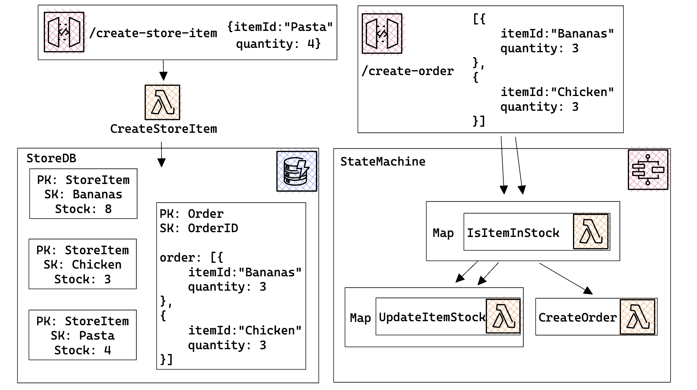
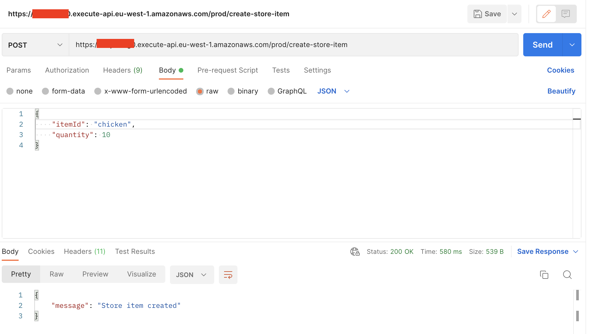
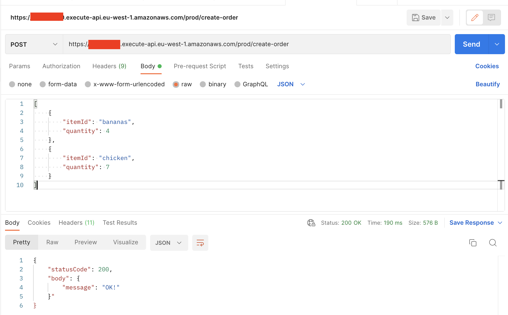
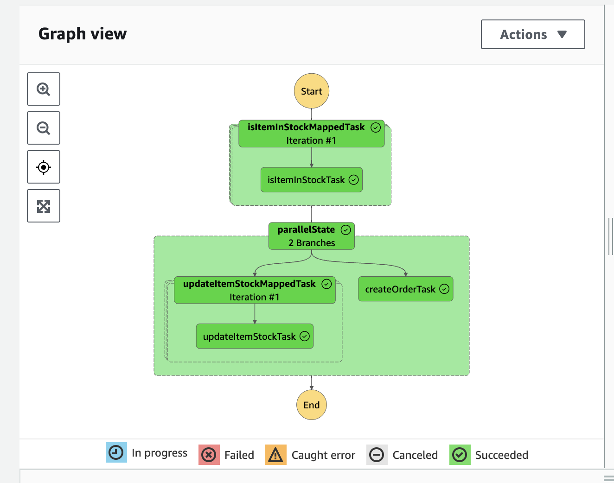
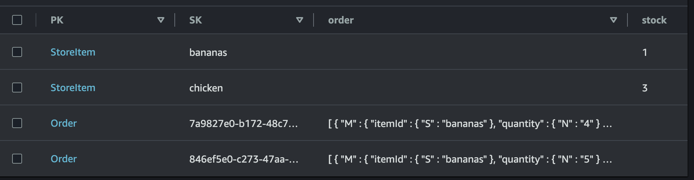
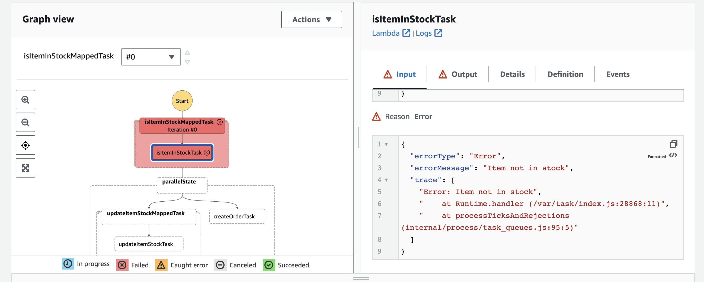

## TL;DR

In this series, I try to explain the basics of serverless on AWS, to enable you to build your own serverless applications. With last article, we discovered how to create a REST API protected by authentication, using Cognito. In this article, let's dive into Step Functions, a service that allows you to orchestrate your serverless applications by building state machines interacting with other AWS services.

## Introduction

When building a serverless application, you want to minimize the responsibilities of each component, especially Lambda functions. You want them to do one thing, and do it well.

To avoid building monolithic functions, that have tons of side effects and are hard to debug, a simple way to do it is to use AWS Step Functions. Instead of having a single Lambda handling data retrieval, processing, storage and side effects like messaging, you can split these responsibilities into multiple Lambdas, and use Step Functions to orchestrate them. You can even get rid of Lambda functions and directly integrate with other AWS services like DynamoDB, S3, SQS, SNS, etc: it's called Functionless programming.

Today, we are going to build together a simple shopping application. We will create a database composed of products, each product will have a stock. We will then create a state machine allowing to create an order based on a shopping cart. First, it will check that every product is in stock, then it will create the order and update the stock of each product at the same time. This orchestration will be done using Step Functions, and will allow to avoid creating an order if one the products is not in stock.

We can describe the architecture of our application like this:



The DB will store products and orders, and a `/create-store-item` will allow to create a new product.

The state machine will be triggered by an API Gateway with the `/create-order` route. First, thanks to a `Map` state, it will check that every product is in stock.

Then, in case of success, it will in parallel:

- create an order
- update the stock of each product thanks to another `Map` state.

_A map state allows the state machine to iterate over an array of items, and execute a task for each item. If one of the tasks fails, the whole state machine fails. If all the tasks succeed, the state machine will continue to the next state._

## Creating a database, an API and all necessary Lambda functions

Let's start by creating the building blocks of our application. We will create a DynamoDB table to store products and orders, an API Gateway to trigger our state machine, and all the Lambda functions that will be used by our state machine.

To provision these resources, I will use the AWS CDK combined with TypeScript. If you are not familiar with this method, feel free to check out the previous articles of this series, where I explain how to use it. Nothing will be new in this section, I already covered Lambda functions, DynamoDB tables and API Gateways in previous articles.

### Provisioning resources

Start by creating a new CDK stack:

```typescript
import * as cdk from 'aws-cdk-lib';
import { Construct } from 'constructs';
import path from 'path';

export class LearnServerlessStack extends cdk.Stack {
  constructor(scope: Construct, id: string, props?: cdk.StackProps) {
    super(scope, id, props);

    // Provision a new REST API Gateway
    const myFirstApi = new cdk.aws_apigateway.RestApi(this, 'myFirstApi', {});

    // Provision a new DynamoDB table
    const storeDB = new cdk.aws_dynamodb.Table(this, 'storeDB', {
      partitionKey: {
        name: 'PK',
        type: cdk.aws_dynamodb.AttributeType.STRING,
      },
      sortKey: {
        name: 'SK',
        type: cdk.aws_dynamodb.AttributeType.STRING,
      },
      billingMode: cdk.aws_dynamodb.BillingMode.PAY_PER_REQUEST,
    });

    // Provision a new Lambda function, and grant it read access to the DynamoDB table
    const isItemInStock = new cdk.aws_lambda_nodejs.NodejsFunction(this, 'isItemInStock', {
      entry: path.join(__dirname, 'isItemInStock', 'handler.ts'),
      handler: 'handler',
      environment: {
        TABLE_NAME: storeDB.tableName,
      },
    });
    storeDB.grantReadData(isItemInStock);

    // Provision a new Lambda function, and grant it write access to the DynamoDB table
    const updateItemStock = new cdk.aws_lambda_nodejs.NodejsFunction(this, 'updateItemStock', {
      entry: path.join(__dirname, 'updateItemStock', 'handler.ts'),
      handler: 'handler',
      environment: {
        TABLE_NAME: storeDB.tableName,
      },
    });
    storeDB.grantWriteData(updateItemStock);

    // Provision a new Lambda function, and grant it write access to the DynamoDB table
    const createOrder = new cdk.aws_lambda_nodejs.NodejsFunction(this, 'createOrder', {
      entry: path.join(__dirname, 'createOrder', 'handler.ts'),
      handler: 'handler',
      environment: {
        TABLE_NAME: storeDB.tableName,
      },
    });
    storeDB.grantWriteData(createOrder);

    // Provision a new Lambda function, and grant it write access to the DynamoDB table
    const createStoreItem = new cdk.aws_lambda_nodejs.NodejsFunction(this, 'createStoreItem', {
      entry: path.join(__dirname, 'createStoreItem', 'handler.ts'),
      handler: 'handler',
      environment: {
        TABLE_NAME: storeDB.tableName,
      },
    });
    storeDB.grantWriteData(createStoreItem);

    // Add a new POST route to the REST API Gateway, and link it to the createStoreItem Lambda function
    const createStoreItemResource = myFirstApi.root.addResource('create-store-item');
    createStoreItemResource.addMethod('POST', new cdk.aws_apigateway.LambdaIntegration(createStoreItem));
  }
}
```

Nothing new here, I create the necessary resources, pass the table name as an environment variable to the Lambda functions, and grant them the necessary permissions.

### Adding code to Lambda functions

Resources are now provisioned, the only part missing is the code of the 4 Lambda functions. Let's start by the `createStoreItem` function:

```typescript
import { DynamoDBClient, PutItemCommand } from '@aws-sdk/client-dynamodb';

const client = new DynamoDBClient({});

export const handler = async ({ body }: { body: string }): Promise<{ statusCode: number; body: string }> => {
  const tableName = process.env.TABLE_NAME;

  const { itemId, quantity } = JSON.parse(body) as { itemId?: string; quantity?: number };

  if (itemId === undefined || quantity === undefined) {
    return {
      statusCode: 200,
      body: JSON.stringify({ message: 'itemId or quantity is undefined' }),
    };
  }

  await client.send(
    new PutItemCommand({
      TableName: tableName,
      Item: {
        PK: { S: 'StoreItem' },
        SK: { S: itemId },
        stock: { N: quantity.toString() },
      },
    }),
  );

  return {
    statusCode: 200,
    body: JSON.stringify({ message: 'Store item created' }),
  };
};
```

This lambda function will be plugged into an API, so it has to respect a certain typing. I quickly sanity check the input, and then use the DynamoDB SDK to create a new item in the table.

Here, I choose the data structure of the StoreItems in the DB: the `PK` will be a constant string `StoreItem`, and the `SK` will be the `itemId`. I also add a `stock` attribute, which will be a number.

If you do not feel comfortable with DynamoDB, feel free to check out my [dynamoDB][dynamodb] article where I explain how to use it.

Then, let's create the `isItemInStock` function:

```typescript
import { DynamoDBClient, GetItemCommand } from '@aws-sdk/client-dynamodb';

const client = new DynamoDBClient({});

export const handler = async ({
  item: { itemId, quantity },
}: {
  item: { itemId: string; quantity: number };
}): Promise<void> => {
  const tableName = process.env.TABLE_NAME;

  const { Item } = await client.send(
    new GetItemCommand({
      TableName: tableName,
      Key: {
        PK: { S: 'StoreItem' },
        SK: { S: itemId },
      },
    }),
  );

  const stock = Item?.stock.N;

  if (stock === undefined || +stock < quantity) {
    throw new Error('Item not in stock');
  }
};
```

Because it is a building block of the future state machine, the typing is simpler. This function receives a single item composed of an `itemId` and a `quantity`. It will check in the store DB if the item is in stock, and throw an error if it is not.

Then, let's create the `updateItemStock` function:

```typescript
import { DynamoDBClient, UpdateItemCommand } from '@aws-sdk/client-dynamodb';

const client = new DynamoDBClient({});

export const handler = async ({
  item: { itemId, quantity },
}: {
  item: { itemId: string; quantity: number };
}): Promise<void> => {
  const tableName = process.env.TABLE_NAME;

  await client.send(
    new UpdateItemCommand({
      TableName: tableName,
      Key: {
        PK: { S: 'StoreItem' },
        SK: { S: itemId },
      },
      UpdateExpression: 'SET stock = stock - :quantity',
      ExpressionAttributeValues: {
        ':quantity': { N: quantity.toString() },
      },
    }),
  );
};
```

In this lambda, the input is the same. To update the stock of an item, without knowing its current value, I use an `UpdateExpression` with the `SET` keyword. I also use an `ExpressionAttributeValues` to pass the `quantity` value to the expression.

Finally, let's create the `createOrder` function:

```typescript
import { DynamoDBClient, PutItemCommand } from '@aws-sdk/client-dynamodb';
import { v4 as uuid } from 'uuid';

const client = new DynamoDBClient({});

export const handler = async ({ order }: { order: { itemId: string; quantity: number }[] }): Promise<void> => {
  const tableName = process.env.TABLE_NAME;

  await client.send(
    new PutItemCommand({
      TableName: tableName,
      Item: {
        PK: { S: 'Order' },
        SK: { S: uuid() },
        order: {
          L: order.map(({ itemId, quantity }) => ({
            M: { itemId: { S: itemId }, quantity: { N: quantity.toString() } },
          })),
        },
      },
    }),
  );
};
```

Here, I put a new item in the DB, with a random `SK` and a constant `PK`. The `order` attribute is an array (L for List) of items (M for Map), each item being composed of an `itemId` and a `quantity`.

We are done with the code! Notice none of the Lambda functions I created have more than one responsibility. They are all very simple, and easy to debug.

Furthermore, they do not return any value: the state machine will handle the data flow between them.

## Creating a state machine to orchestrate the application

The exciting part of this article is coming! We are going to provision a new state machine, that will handle the flow of data between the 3 Lambda functions `isItemInStock`, `updateItemStock` and `createOrder`.

First, let's settle for a data structure: the input of the state machine will be of the following type: `{ order: { itemId: string, quantity: number }[] }`.

Notice how it interacts with the input types I defined for the Lambda functions:

- `isItemInStock` and `updateItemStock` expect a single item of the input
- `createOrder` expects the full array of items.

Let's start by creating tasks. Tasks are the building blocks of state machines. I will create 3 tasks, one for each Lambda function:

```typescript
import { JsonPath } from 'aws-cdk-lib/aws-stepfunctions';

// ...

// Create a Map task, iterating over the items of the input
const isItemInStockMappedTask = new cdk.aws_stepfunctions.Map(this, 'isItemInStockMappedTask', {
  itemsPath: '$.order',
  resultPath: JsonPath.DISCARD,
  parameters: {
    'item.$': '$$.Map.Item.Value',
  },
}).iterator(
  new cdk.aws_stepfunctions_tasks.LambdaInvoke(this, 'isItemInStockTask', {
    lambdaFunction: isItemInStock,
  }),
);

// Create a Map task, iterating over the items of the input
const updateItemStockMappedTask = new cdk.aws_stepfunctions.Map(this, 'updateItemStockMappedTask', {
  itemsPath: '$.order',
  resultPath: JsonPath.DISCARD,
  parameters: {
    'item.$': '$$.Map.Item.Value',
  },
}).iterator(
  new cdk.aws_stepfunctions_tasks.LambdaInvoke(this, 'updateItemStockTask', {
    lambdaFunction: updateItemStock,
  }),
);

// Create simple task, calling the createOrder Lambda function
const createOrderTask = new cdk.aws_stepfunctions_tasks.LambdaInvoke(this, 'createOrderTask', {
  lambdaFunction: createOrder,
});
```

There is a lot to be discussed in the above code snippet:

- Map tasks are used to iterate over an array of items, and execute a task for each item.

  - `itemsPath` is used to specify where to find the array of items in the input. Based on the input, the array of items is located at `$.order`. It is a special AWS syntax, you can learn more about it [here](https://docs.aws.amazon.com/step-functions/latest/dg/input-output-inputpath-params.html).
  - `parameters` is used to specify the input of the task. Here, I want to pass the item I have iterated over to the Lambda function. I use the special syntax `$$` to access the current item of the iteration. Once again, more details can be found in the AWS documentation.
  - `resultPath` is used to specify where to store the result of the task. Here, I do not want to store the result of the task, so I discard it.

- LambdaInvoke tasks are used to call a Lambda function. We simply specify the Lambda function to call, based on what we provisioned earlier.

The three building blocks of the state machine are ready, let's orchestrate them by creating a new state machine:

```typescript
const parallelState = new cdk.aws_stepfunctions.Parallel(this, 'parallelState', {});

parallelState.branch(updateItemStockMappedTask, createOrderTask);

const definition = isItemInStockMappedTask.next(parallelState);

const myFirstStateMachine = new cdk.aws_stepfunctions.StateMachine(this, 'myFirstStateMachine', {
  definition,
});
```

Looking at the definition, we see that we first execute the `isItemInStockMappedTask`, then the `parallelState`. The `parallelState` is composed of two branches:

- `updateItemStockMappedTask`
- `createOrderTask`

The cool thing is that the parallel state will only execute if the `isItemInStockMappedTask` succeeds (if every task of the map succeeds). If it fails, the state machine will stop.

## Triggering the state machine with an API Gateway

The icing on the cake: we are going to trigger the state machine with an API call. To demonstrate functionless programming, we will not use a Lambda function to trigger the state machine, but directly the API Gateway.

To do this, I have two things to do:

- Create an IAM role allowing the API Gateway to trigger the state machine
- Create a new POST route on the API Gateway, and link it to the state machine. The route will "assume" the IAM role, to be able to trigger the state machine.

### Creating an IAM role to execute the state machine

The creation of the IAM role is pretty straightforward:

```typescript
const invokeStateMachineRole = new cdk.aws_iam.Role(this, 'invokeStateMachineRole', {
  assumedBy: new cdk.aws_iam.ServicePrincipal('apigateway.amazonaws.com'),
});

invokeStateMachineRole.addToPolicy(
  new cdk.aws_iam.PolicyStatement({
    actions: ['states:StartExecution'],
    resources: [myFirstStateMachine.stateMachineArn],
  }),
);
```

First, by setting a "principal", I define that the role will be assumed by an API. Then, I add a policy allowing the API to start the execution of the state machine, and I specify the state machine ARN, to narrow the scope of the policy only to this state machine.

### Triggering the state machine with a POST route

This part is a little bit more convoluted:

```typescript
const createOrderResource = myFirstApi.root.addResource('create-order');

createOrderResource.addMethod(
  'POST',
  new cdk.aws_apigateway.Integration({
    type: cdk.aws_apigateway.IntegrationType.AWS,
    integrationHttpMethod: 'POST',
    uri: `arn:aws:apigateway:${cdk.Aws.REGION}:states:action/StartExecution`,
    options: {
      credentialsRole: invokeStateMachineRole,
      requestTemplates: {
        'application/json': `{
        "input": "{\\"order\\": $util.escapeJavaScript($input.json('$'))}",
        "stateMachineArn": "${myFirstStateMachine.stateMachineArn}"
      }`,
      },
      integrationResponses: [
        {
          statusCode: '200',
          responseTemplates: {
            'application/json': `{
            "statusCode": 200,
            "body": { "message": "OK!" }"
          }`,
          },
        },
      ],
    },
  }),
  {
    methodResponses: [
      {
        statusCode: '200',
      },
    ],
  },
);
```

First, I add a new POST route to the API. Then, instead of plugging it to a Lambda function, like we are used to, I define a custom integration. This integration will allow me to call the state machine directly.

Worth to be noted:

- The `uri` is a special AWS syntax, that allows to call a specific AWS service. Here, I call the `StartExecution` action of the `states` service, which is the Step Functions service.
- In the `options`:

  - I specify the IAM role to assume (the one I create earlier)
  - I specify the input of the state machine. In the `input` field, using the same AWS syntax as before, I transform the body of the POST route into the data structure expected by the state machine. In the `stateMachineArn` field, I specify the ARN of the state machine to call.
  - I specify the response of the API. Here, I simply return a 200 status code with a message.

- Finally, in the method responses, I specify the response of the API. Here, I simply return a 200 status code. This response has to match with one of the responses defined in the `integrationResponses`, or the API will return a 500 status code.

This part was quite advanced, here is a [really nice article][integration-article] I found, going more into details about this integration. I highly recommend you to read it! Do not hesitate to contact me if you have any questions, I will be happy to help!

We are done with the code! Time to deploy it:

```bash
npm run cdk deploy
```

## Testing the application

First, let's start by creating new products, here is an example request:



Then, let's create a new order:



Taking a look at the logs of the state machine, we can see that it succeeded, and we find the same structure as what was planned at the beginning of the article:



Finally, let's check the content of the DB:



We can see that the order has been created, and the stock of each product has been updated.

If we try to repeat the same request, the state machine will eventually fail, because the products are not in stock anymore:



## Conclusion

This tutorial was a shallow introduction to Step Functions. Much more can be done with this service, especially using messaging services like SES or SNS to send notifications to users. Stay tuned, I will cover these topics in future articles!

I plan to continue this series of articles on a bi-monthly basis. I already covered the creation of simple lambda functions and REST APIs, as well as interacting with DynamoDB databases and S3 buckets. You can follow this progress on my [repository][repository]! I will cover new topics like creating event-driven applications, type safety, and more. If you have any suggestions, do not hesitate to contact me!

I would really appreciate if you could react and share this article with your friends and colleagues. It will help me a lot to grow my audience. Also, don't forget to subscribe to be updated when the next article comes out!

I you want to stay in touch here is my [twitter account][twitter account]. I often post or re-post interesting stuff about AWS and serverless, feel free to follow me!

[repository]: https://github.com/PChol22/learn-serverless
[twitter account]: https://twitter.com/PierreChollet22
[dynamodb]: https://dev.to/kumo/learn-serverless-on-aws-step-by-step-databases-kkg
[integration-article]: https://dev.to/aws-builders/api-gateway-rest-api-step-functions-direct-integration-aws-cdk-guide-13c4
