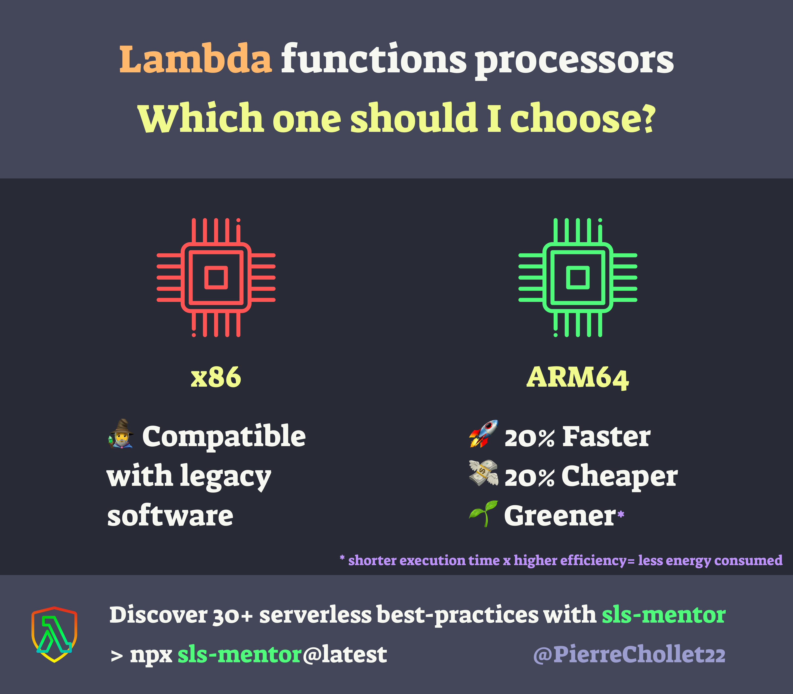
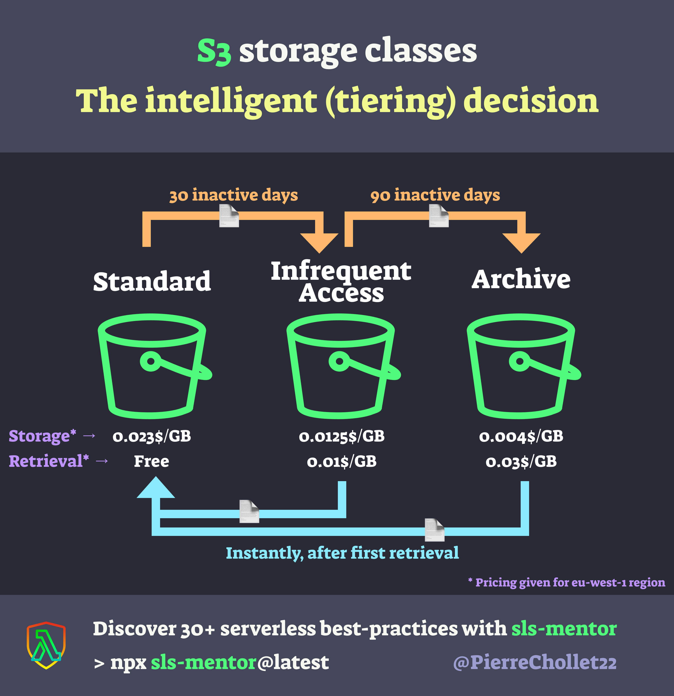
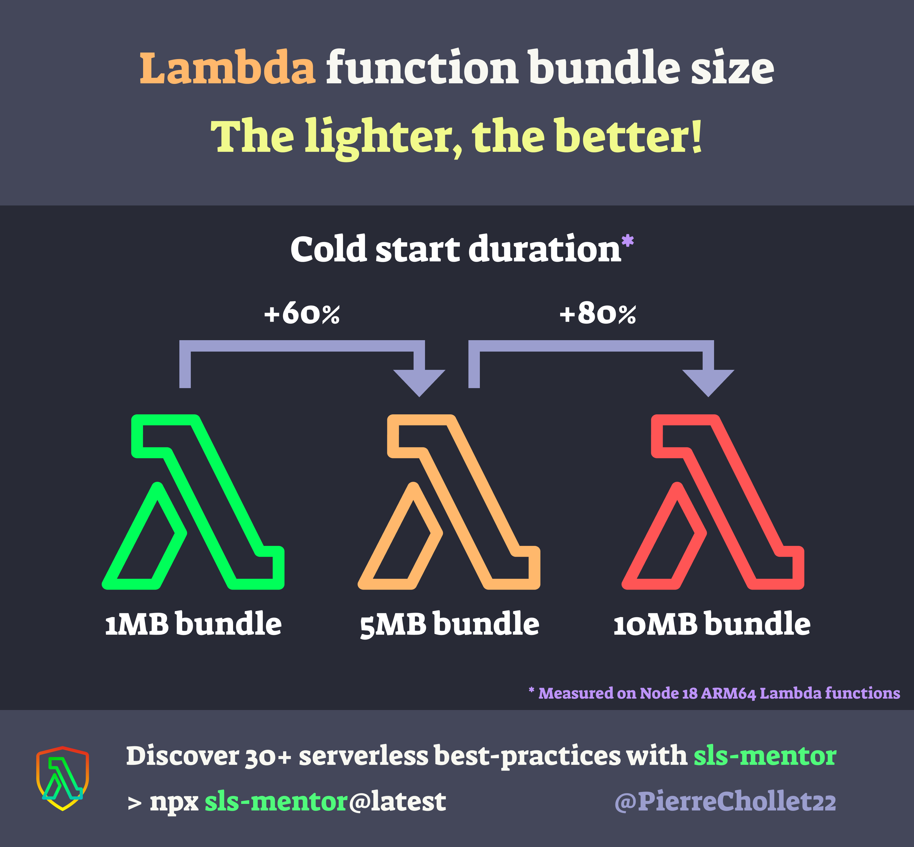
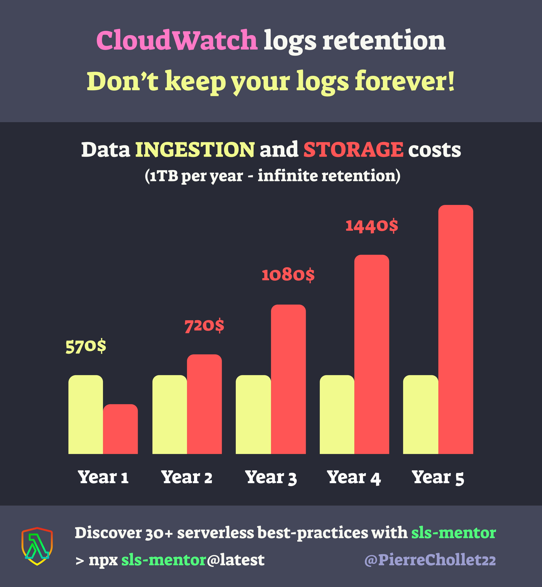
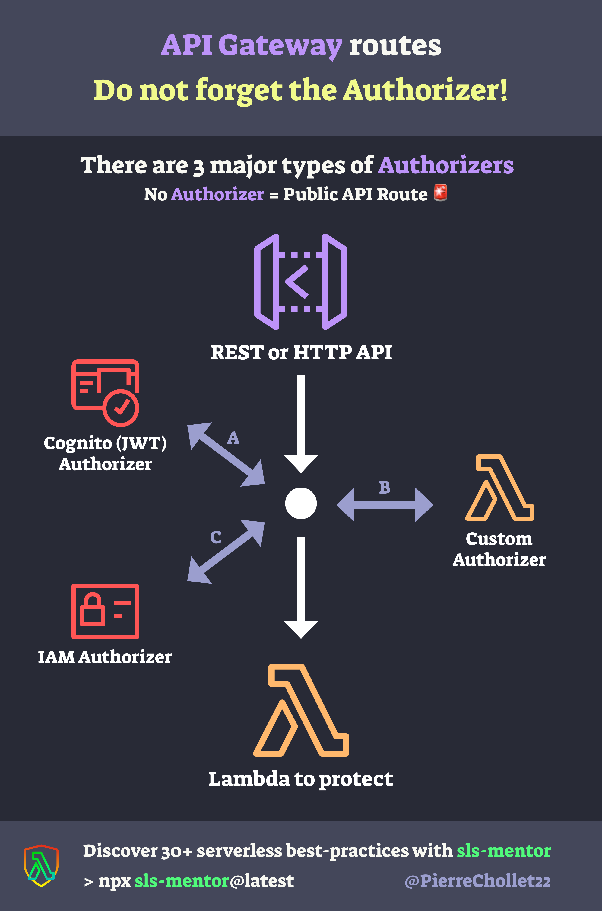

### Discover serverless best practices with sls-mentor

In this article, I will go through 5 low cost, high impact serverless best practices that will help you build faster, cheaper, greener, more secure and stable applications on AWS.

Each best practice is illustrated with an infographic, to make it easy to understand and share with your colleagues. I hope you will enjoy it!

This compilation is based on [🛡 sls-mentor 🛡][sls-mentor], my free open-source tool that **automatically checks 30 serverless best practices on your AWS serverless projects** (no matter the framework). Feel free to check it out!

 Find sls-mentor on Github ⭐️ 

### Let's connect!

I you want to stay in touch here is my [twitter account][twitter]. I often post or re-post interesting stuff about AWS and serverless, feel free to follow me!

 Follow me on twitter 🚀 

## 1 - When deploying a Lambda function, use a ARM64 architecture instead of a x86_64 architecture

Two Lambda function processors are available, how to choose wisely? 🤔

Basically, **you should always go with ARM64** if your code is compatible! 🚀

[🛡 sls-mentor][sls-mentor] has a rule that enforces the usage of ARM64 in your Lambda functions so that you never forget 🧠

## 2 - Use intelligent tiering on S3 Buckets to reduce storage costs

Which storage class fits the best for my #AWS app?

The choice is easy: **use Intelligent Tiering!** It automatically moves files between classes based on their usage.

[🛡 sls-mentor][sls-mentor] automatically check that your buckets have Intelligent Tiering enabled, so that you never forget🧠

## 3 - Deploy fast Lambda functions with bundles smaller than 5MB

My Lambda function has insane cold starts, what should I do? 😿

Short answer: **make its bundle smaller!** On a given runtime, bundle size is the n°1 cause of long cold starts 🐢

[🛡 sls-mentor][sls-mentor] lists every Lambda function with a bundle larger than 5MB, try it on your @awscloud account!

## 4 - Do not keep your CloudWatch logs forever to reduce storage costs

CloudWatch by @awscloud is known to be expensive 💸

There is a simple trick to reduce costs: 🚨Do not keep your logs forever🚨

Storage is cheap, but accumulating it over years quickly gets out of hands 📈

[🛡 sls-mentor][sls-mentor] can list Log Groups with infinite retention, try it out 🚀

## 5 - Use an Authorizer on all your API Gateway endpoints to secure your API

When deploying an API, **anyone with its URL can access your resources by default** 😱

Authorizers allow you to secure your API, by relying on Cognito, IAM, or any custom integration.

[🛡 sls-mentor][sls-mentor] can list all API Gateway endpoints without an Authorizer, try it out 🚀

## Many more best practices to discover and automate!

[🛡 sls-mentor][sls-mentor] is a compilation of 30 serverless best-practices, that are automatically checked on your AWS serverless projects (no matter the framework). It is free and open source, feel free to check it out!

 Find sls-mentor on Github ⭐️ 

### Let's connect!

I would really appreciate if you could react and share this article with your friends and colleagues. It will help me a lot to grow my audience. Also, don't forget to subscribe to be updated when the next article comes out!

I you want to stay in touch here is my [twitter account][twitter]. I often post or re-post interesting stuff about AWS and serverless, feel free to follow me!

 Follow me on twitter 🚀 

[twitter]: https://twitter.com/PierreChollet22
[sls-mentor]: https://www.sls-mentor.dev
