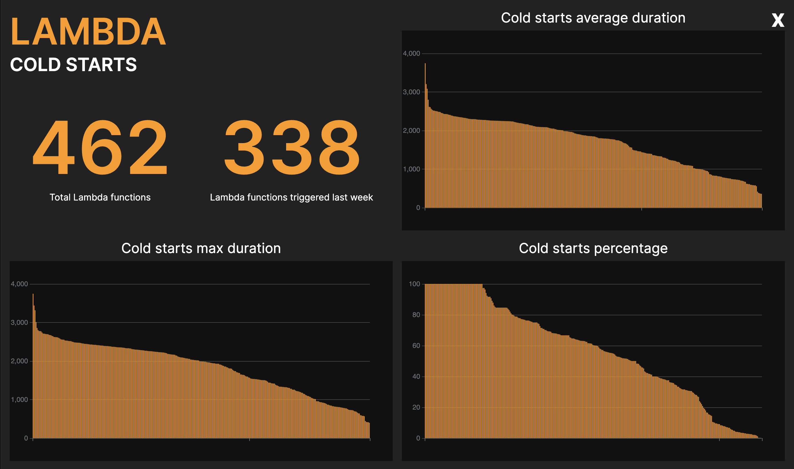
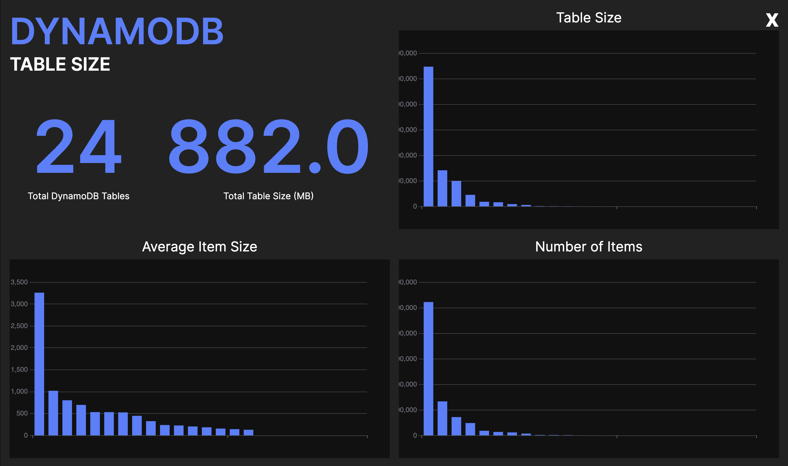

## Your serverless app like you've never seen it before with sls-mentor

Ever dreamed of being able to visualize and analyze your entire AWS application at a glance? With the new 3.0 (alpha) of sls-mentor, it is now possible!



sls-mentor is a **free** and **open-source** tool that generates an interactive graph of your AWS application. This graph contains all the interactions between components of your app (Lambda functions, DynamoDB tables, S3 buckets...).

sls-mentor also has a brand new feature: **Dashboards**. With dashboards, you have access to stats about your app such as :

- Lambda Cold start duration 🏎
- Lambda Bundle size 📦
- S3 bucket size 🪣
- DynamoDB table size 📊
- And more to come! ✨





## How to run sls-mentor?

You only need your CLI to run the new 3.0 of sls-mentor, simply use:

```sh
npx sls-mentor@alpha -p <AWS_CLI_PROFILE> -r <AWS_REGION>
```

 Star sls-mentor on Github ⭐️ 

sls-mentor will perform its analysis live, on the AWS Account associated with the CLI profile.

There are also filtering options: `-c` to specify cloudformation stacks, `-t` for tags

## We need you!

If you enjoyed trying sls-mentor 3.0, your feedback is valuable! Feel free to comment or to contact me on twitter

 Contact me on twitter 🚀 

We are also open to contributions!

 Contribute on Github ⭐️ 
